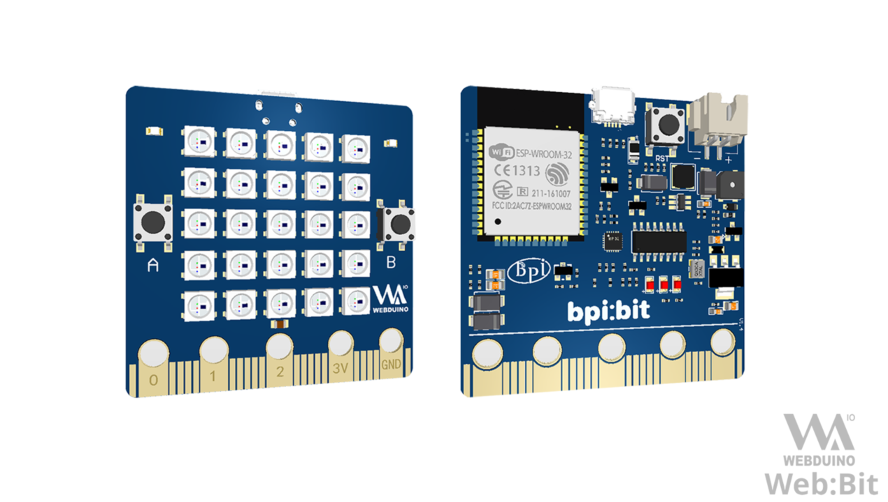

BPI-STEAM 用户文档
===================

BPI-STEAM 是专注于软硬件开源技术的开源组织，属于 `Banana-Pi <http://www.banana-pi.org/>`_ 的分支，从 2018 年起推出 BPI-BIT 开发板，随之推出 Webduino 、 MicroPython 、 Arduino 等开源技术支持，通过用户文档能够让用户轻松入门 BPI-STEAM 所提供的技术产品。

.. Hint::

    本文档托管于 `BPI-STEAM <https://github.com/BPI-STEAM>`_ 开源组织。

认识 BPI-BIT 开发板
-------------------

BPI-BIT 是一款基于 ESP32 高性能芯片且兼容 micro:bit 设计的开源 STEAM 教育开发板，又名 Bpi:Bit、Web:Bit 。

.. toctree::
    :maxdepth: 2

    bpi-steam/hardware
    bpi-steam/driver

使用 Webduino 编程
------------------

通过 Web:Bit 专用积木编辑器，使用拖拽积木来轻松学习编程吧。

.. image:: _static/editor.png

.. toctree::
    :maxdepth: 2
    :caption: Webduino 目录

    webduino/install&use
    webduino/tutorials/index
    webduino/advanced/index
    webduino/modules/index

使用 MicroPython 编程
---------------------------

通过烧写 MicroPython 固件，就可以在开发板中使用 Python 语言进行编程。

在下述目录将提供丰富的示例代码以及专业 IDE 的支持（如：VsCode、PyCharm）。

.. toctree::
    :maxdepth: 2
    :caption: MicroPython 目录

    micropython/tutorials/index
    micropython/advanced/index
    micropython/samples/index
    micropython/modules/index
    mPython/docs/library/micropython/index.rst
    mPython/docs/library/pythonStd/index.rst

使用 Arduino 编程
---------------------------

.. Hint::

    Arduino 将不会阐述过多基础内容，请具备 C/C++ 的语言开发基础。

提供了入门 Arduino 的软件工具和最佳示例，降低进入 ESP32 嵌入式专业开发的门槛。

.. toctree::
    :maxdepth: 2
    :caption: Arduino 目录

    arduino/tutorials/index
    arduino/advanced/index
    arduino/modules/index

.. BPI-BIT 拓展板
.. ---------------------------

.. BPI-BIT 大幅度的兼容 microbit 的底座硬件设计与使用，你可以查看以下支持的 Microbit 的拓展板，或根据我们提供的拓展板设计方案进行拓展应用。

.. .. toctree::
..     :maxdepth: 2
..     :caption: Bit 拓展板

.. 
.. toctree::
    :maxdepth: 2
    :caption: 引用区域
    mPython/docs/index
    micropython/docs/index
.. 

.. image:: _static/footer.png

Indices and tables
==================

* :ref:`genindex`
* :ref:`modindex`
* :ref:`search`
