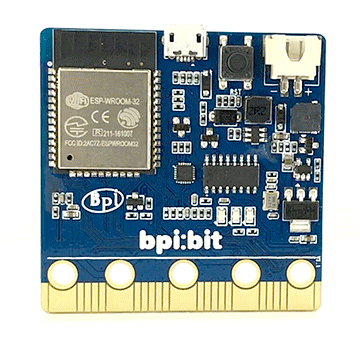

.. Introduction to BPI-STEAM documentation master file, created by
   sphinx-quickstart on Sun May 26 22:43:43 2019.
   You can adapt this file completely to your liking, but it should at least
   contain the root `toctree` directive.

Welcome to BPI-STEAM documentation!
=====================================================

.. Hint::

    欢迎来到 BPI-STEAM 的系列用户文档发布网站，本项目托管于 `Github Docs <https://github.com/BPI-STEAM/Docs>`_ 。

.. Attention::

    由于开源发展迅速，文档中存在着英文最新的参考文档，有助于开发者在日后的学习和查阅 API 所用，无法完全中文内容，还请谅解。

为您介绍一下 BPI-BIT 这款产品的基本信息。

BPI-BIT 是一款基于 ESP32 高性能芯片且兼容 micro:bit 设计的开源 STEAM 教育产品。

.. toctree::
   :maxdepth: 2
   :caption: BPI-BIT
   
   bpi-steam/readme
   bpi-steam/driver

用户可以通过烧写 MicroPython 固件，就能够使用当下世界上最流行的 Python 语言进行编程。

配合专业 IDE 的支持（如：VsCode、PyCharm），以便您轻松地将代码从电脑传输到板子中，从而体验程序创作的无穷乐趣！

.. toctree::
   :maxdepth: 2
   :caption: MicroPython

   bpi-dev/mpy-tutorials
   bpi-dev/mpy-release

   mPython/docs/library/pythonStd/index.rst
   mPython/docs/library/micropython/index.rst
   micropython/docs/index

用户可以通过烧写 Webduino 固件，就能够使用面向全世界的 Webduino Blockly 积木化在线编程。

只需要浏览器，随时查看云端和托管你的代码，配合 Github 上各种有趣的插件系统与多语言化环境，享受全世界流行的积木编程吧!

.. toctree::
   :maxdepth: 2
   :caption: Webduino
   
   bpi-dev/web-tutorials
   bpi-dev/web-release

.. toctree::
   :maxdepth: 2
   :caption: 拓展板

.. 
.. toctree::
   :maxdepth: 2
   :caption: 引用区域
   mPython/docs/index
   micropython/docs/index
.. 

.. image:: ../images/logo.png

Indices and tables
==================

* :ref:`genindex`
* :ref:`modindex`
* :ref:`search`
