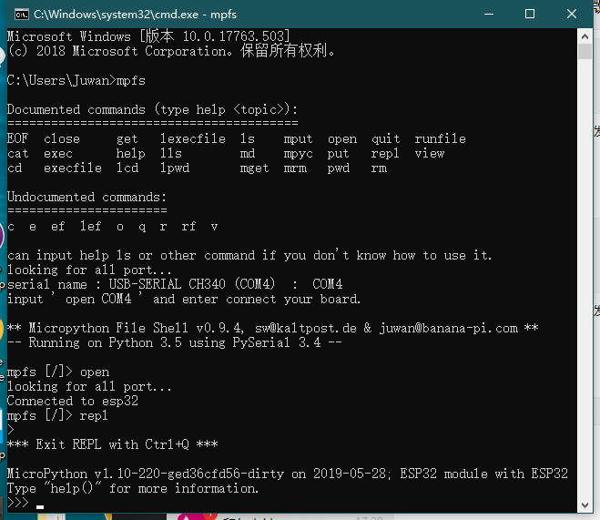

再谈 REPL
=============================

.. Attention::

    请确认您的编程环境里已经安装了 Python3 和 pip 工具，否则下面的内容你都无法开始。
    
    这里推荐使用 `MicroPython-Samples <https://github.com/BPI-STEAM/MicroPython-Samples>`_ 来部署你的开发环境。

我们已经知道 REPL 可以进行一些简单的代码交互和反馈，现在我们就要让重新认识一下 REPL 了。

安装 mpfshell 工具
----------------------------------------

请从此处获取  `mpfshell-lite <https://github.com/BPI-STEAM/mpfshell-lite>`_  工具，安装与使用方法均在此提及。

在 mpfshell 的 REPL
----------------------------------------

安装了它，在 repl 即可使用下述的功能，当然你也可以在 Xshell 、 MobaXterm 等其他串口终端中实现。

输入历史记录
~~~~~~~~~~~~~~~~~~~~~~~~~~~~~~

REPL 会记住您输入的一定数量的前几行文本（在 ESP32 上最多 8 行）。
要调用上一行，请使用 向上 和 向下 箭头键。

使用 Tab 键
~~~~~~~~~~~~~~~~~~~~~~~~~~~~~~

Tab 键可以查看模块中所有成员列表。这对于找出模块或对象具有的函数和方法非常有用。
假设您在下面的例子中导入了 import machine 然后键入 ``.`` 再按 Tab 键以查看 machine 模块所有成员列表::

    >>> import machine
    >>> machine.
    __class__        __name__        ADC              DAC
    DEEPSLEEP        DEEPSLEEP_RESET                  EXT0_WAKE
    EXT1_WAKE        HARD_RESET       I2C              PIN_WAKE
    PWM              PWRON_RESET     Pin              RTC
    SLEEP            SOFT_RESET       SPI              Signal
    TIMER_WAKE       TOUCHPAD_WAKE    Timer            TouchPad
    UART             ULP_WAKE        WDT              WDT_RESET
    deepsleep        disable_irq     enable_irq       freq
    idle             mem16            mem32            mem8
    reset            reset_cause     sleep            time_pulse_us
    unique_id        wake_reason
    >>> machine.

行继续和自动缩进
~~~~~~~~~~~~~~~~~~~~~~~~~~~~~~

您键入的某些内容将需要“继续”，也就是说，需要更多行文本才能生成正确的 Python 语句。在这种情况下，
提示符将更改为``...``并且光标将自动缩进正确的数量，以便您可以立即开始键入下一行。
通过定义以下函数来尝试此操作::

    >>> def toggle(p):
    ...    p.value(not p.value())
    ...    
    ...    
    ...    
    >>>

在上面，您需要连续按三次Enter键才能完成复合语句（即三条线上只有点）。完成复合语句的另一种方法是按退格键到达行的开头，然后按Enter键。 （如果您输错了并且想要退出，那么按ctrl-C，所有行都将被忽略。）

您刚刚定义函数功能为翻转引脚电平。您之前创建的pin对象应该仍然存在
（如果没有，则需重新创建它），您可以使用以下命令翻转LED::

    >>> toggle(pin)

现在让我们在一个循环中翻转 LED （如果您没有 LED ，那么您可以打印一些文本而不是调用切换，看看效果）：

    >>> import time
    >>> while True:
    ...     toggle(pin) # print('test')
    ...     time.sleep_ms(500)
    ...    
    ...    
    ...    
    >>>

这将以1Hz（半秒开，半秒关）翻转LED。要停止切换按 ``ctrl-C`` ，这将引发键盘中断异常并退出循环。

粘贴模式
~~~~~~~~~~~~~~~~~~~~~~~~~~~~~~

按 ``ctrl-E`` 将进入特殊粘贴模式，您可将一大块文本复制并粘贴到REPL中。如果按ctrl-E，您将看到粘贴模式提示::

    paste mode; Ctrl-C to cancel, Ctrl-D to finish
    === 

然后，您可以粘贴（或键入）您的文本。请注意，没有任何特殊键或命令在粘贴模式下工作（例如Tab或退格）
，它们只是按原样接受。按 ``ctrl-D`` 完成输入文本并执行。

其他控制命令
~~~~~~~~~~~~~~~~~~~~~~~~~~~~~~

还有其他四个控制命令：

- 空白行上的 Ctrl-A 将进入原始 REPL 模式。这类似于永久粘贴模式，除了不回显字符。

- 空白处的 Ctrl-B 转到正常的 REPL 模式。

- ``Ctrl-C`` 取消任何输入，或中断当前运行的代码。

- 空白行上的 ``Ctrl-D`` 将执行软重启。

管理板子上的文件
----------------------------------------

mpfs 提供了真正意义上的文件管理功能，近似大多数 linux 终端文件管理工具。

MicroPython 内部提供了基于 oofats 建立的 FAT16 分区文件系统，就可以在上面存放一些文件内容，如代码文件、资源文件、音乐文件等等。

详细的你需要去看 mpfshell 的 readme 文档，在这里我说明几个重要功能即可。

.. Note::

    mpfs 即为 mpfshell 的简称。

运行 python 文件 lexecfile 和 execfile
~~~~~~~~~~~~~~~~~~~~~~~~~~~~~~~~~~~~~~~~~~~~~~~~~~~~~~~~~~~~

execfile 指运行板子上存在的代码文件，添加了 l 即可将本地的代码文件传到板子中并进入 repl 中运行。

查看板子上的所有文件 ls
~~~~~~~~~~~~~~~~~~~~~~~~~~~~~~~~~~~~~~~~~~~~~~~~~~~~~~~~~~~~

这将列举板子上所有的目录、文件的名称。

.. code:: shell

    mpfs [/]> ls

    Remote files in '/':

        boot.py
        wifi_cfg.py

快速查看文件内容 cat
~~~~~~~~~~~~~~~~~~~~~~~~~~~~~~~~~~~~~~~~~~~~~~~~~~~~~~~~~~~~

假如要查看上述所显示的 boot.py 文件，输入 cat boot.py 。

.. code:: shell

    mpfs [/]> cat boot.py
    # This file is executed on every boot (including wake-boot from deepsleep)
    #import esp
    #esp.osdebug(None)
    #import webrepl
    #webrepl.start()
    import wifi
    wifi.ready()

    mpfs [/]>

删除指定文件 rm
~~~~~~~~~~~~~~~~~~~~~~~~~~~~~~~~~~~~~~~~~~~~~~~~~~~~~~~~~~~~

假如要删除上述所显示的 boot.py 文件，输入 rm boot.py 即可，此操作不可逆。

文件的 推送 put 和 获取 get 
~~~~~~~~~~~~~~~~~~~~~~~~~~~~~~~~~~~~~~~~~~~~~~~~~~~~~~~~~~~~

这两兄弟可以帮你把文件下载或上传，保存在 lpwd 目录下，可用 lcd 修改。

还有更多功能你需要 亲自去尝试 或 在工具的文档中 寻找答案。
