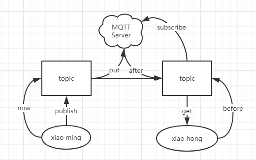
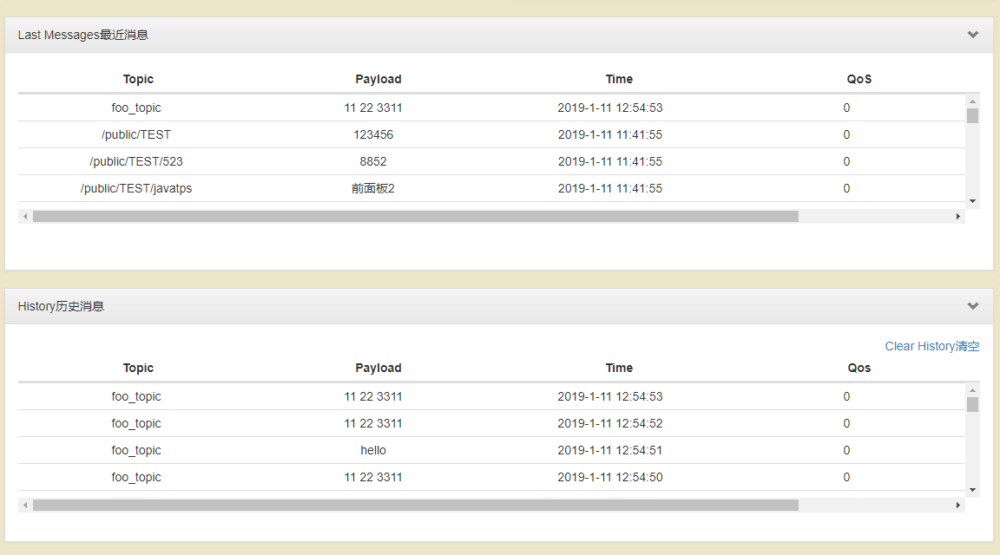

尝试 MQTT 应用
=====================================================

MQTT 是什么？
---------------------------

MQTT 现今是物联网的重要组成部分，它的服务外层拥有复杂的安全性功能，同时架构设计上属于数据转发服务器，举例来说，一个 MQTT 的服务器，可以解决不同类型的两套系统的数据交换，通过订阅与收发的接口设计，使得它只负责将两端的数据进行一个交换即可。

MQTT 服务器的传输模式可以认为是大家通过各自的内部约定后进入了一个公共的聊天室，如果你想和别人进行沟通，你可以创建一个聊天室（推送），你也可以加入别人的聊天室（订阅），服务器不管你们之间如何沟通，它只会帮你把这个聊天室建立起来，你们之间自由交换信息即可，也就因此完成了传输。

举例来说：

小明想向小红发送消息，那么小明可以创建一个话题（topic）的聊天室进行发送（publish），然后小红去加入（subscribe）这个话题（topic）的聊天室，这样她就可以收到小明的信息了，旧版的 MQTT 的聊天室是公开的，彼此之间可以任意加入别人的话题，也就是其他人也可以接收到小明的消息，但现在的 MQTT 服务器允许你私底下定义权限（config），让小明的话题（topic）只有小红可以加入。

.. Hint::

    在这样的架构下，我们之间的代码都是客户端代码，也就不需要去另外写服务端的接收程序了，只要双方约定好接口的数据协议就可以了，由于之间的通信过于透明，所以它目前的安全性还过分依赖于表层的认证，往后也会对此权限与通信控制进行改进的。

准备 MQTT 服务器
---------------------------

使用公共的 MQTT 服务器，如果你没有服务器的话，点此进入\ `通信猫 MQTT 服务器`_ ，注意看说明 WS 和 TCP 服务器的端口不一致，所以自己连接的时候是要改动一下服务器端口。

你也可以直接在网上进行测试体验 MQTT 服务，订阅自己的主题信息和发送自己的主题信息。

.. image:: mqtt/online_demo.png

如果不想使用网络的 MQTT 服务器，则你可以使用一下本地 `mosquitto Windows`_ 服务器环境包，解压直接运行 mosquitto.exe 即可，其中配置文件是 mosquitto.conf 。

.. image:: mqtt/config.png

正常情况下运行后它不会有任何数据显示的，否则会报错闪退，所以不用担心它是否有在工作，如果需要确认它是否工作正常，可以按以下教程来尝试。

- `windows环境下mosquitto环境搭建与mqtt测试`_

- `Windows安装mosquitto`_

- `MQTT教學（二）：安裝MQTT伺服器Mosquitto，Windows系統篇`_

启动 MQTT 客户端
---------------------------

请先确认联网了后即可开始 MQTT 服务。

现在准备如下代码

.. code:: python

    import wifi
    wifi.start()

    server_ip = "mq.tongxinmao.com" # 在线公共的 MQTT 服务器
    client_id = "umqtt_client" # 客户端 ID ，随意定义，用来标识自己发出的数据。

    import time

    from umqtt.robust import MQTTClient

    try:
        # see https://github.com/micropython/micropython-lib/blob/master/umqtt.simple/umqtt/simple.py
        c = MQTTClient(client_id, server_ip, 18830) # 配置连接，这个是连通信猫的服务器配置，端口是 18830，一般默认的是 1883

        c.DEBUG = True # 输出 Debug 信息

        def sub_cb(topic, msg):
            print((topic, msg))
            c.publish(topic, msg) # 无论收到什么订阅的信息都以同样的主题和数据传回。

        c.set_callback(sub_cb) # 把向远端订阅（subscribe）的数据接收回调处理。

        if not c.connect(clean_session=False):
            c.subscribe(b"foo_topic") # 订阅一个 foo_topic 的主题（topic）

        c.publish(b"foo_topic", b"hello") # 向  foo_topic 的主题（topic）发送 hello 字符串。

        while 1:
            # 让芯片运行慢一点，便于观察现象。
            time.sleep(1)

            # 等待处理 MQTT 的数据
            if c.check_msg() is not None:
                c.wait_msg()

            # 没数据可以处理的时候可以做点别的事情
            else:
                print('other operator')

    finally:
        c.disconnect() # 调试程序事重开服务，要记得收尾，否则将重启板子才可以继续。

.. _通信猫 MQTT 服务器: http://www.tongxinmao.com/txm/webmqtt.php
.. _mosquitto Windows: https://github.com/BPI-STEAM/BPI-BIT-MicroPython/releases/tag/windows-mosquitto
.. _windows环境下mosquitto环境搭建与mqtt测试: https://blog.csdn.net/pgpanda/article/details/51800865
.. _Windows安装mosquitto: https://www.cnblogs.com/xhxljh/p/7307100.html
.. _MQTT教學（二）：安裝MQTT伺服器Mosquitto，Windows系統篇: http://swf.com.tw/?p=1005

以上便是 MQTT 的具体实例，运行起来的应该有如下效果。

1. 板子将向订阅了 foo_topic 主题的发送一条 ``hello``
    数据，此时在网页上订阅该主题的用户应该会得到该数据，并显示出来。

2. 板子订阅了 foo_topic 主题，所以会接收到 1 自己先前发送的 ``hello``
    数据，然后根据代码可知，它会把这条接收的数据原封不动的发回去，所以这时候板子会在
    foo_topic 主题上循环接收和发送数据。

3. 如果我们在网页端部分向 foo_topic
    主题发送了数据，则板子会接收到数据并对应显示数据，例如图中所看到的
    ``11 22 3311`` 数据，注意这时候，你发的新数据也会参与 2
    中所提及的循环输出数据了。

.. image:: mqtt/online_test.png

如果是网页上则会显示你在板子中定义发送的数据。

