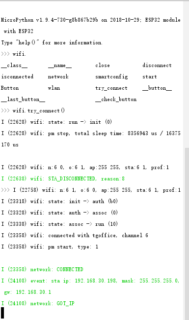
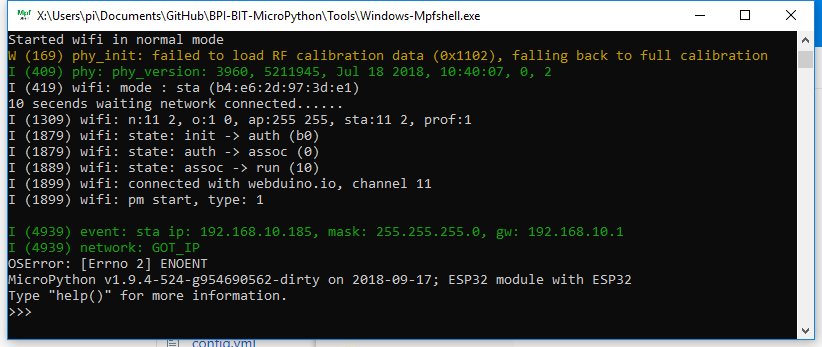
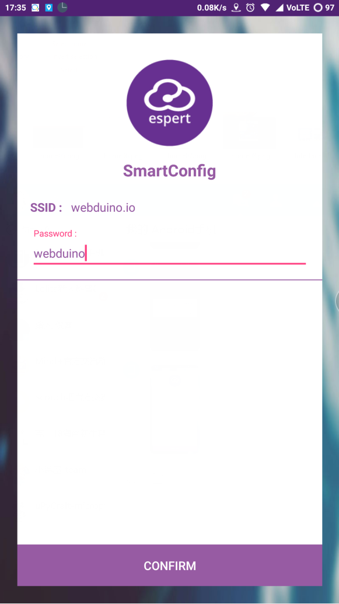
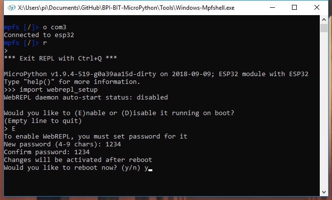

让板子联上网
=====================================================

.. Attention::

    20190528 以后正式版的固件已经关闭了 debug 信息，所以你需要禁用下述代码，可在 boot.py 内容修改它。
    
    .. code:: python

        import esp
        esp.osdebug(None)

连接 WIFI 热点
---------------------------

固件上电后，在面板 LED 灯滚动完毕后，默认就会尝试联网，你可以注意到，如果这时候被工具或人为的 Ctrl + C 停止后，将不会进行联网操作，需要使用以下代码

.. code:: python

    import wifi # booy.py default enable
    wifi.try_connect()

效果如下图，默认 boot.py 里会默认调用
``import wifi``\ ，所以你也可以直接在 REPL 中调用
``wifi.try_connect()``\ 。

在默认的联网模式下，如果从来没有配网过，板子最初会自动连接 WIFI 名称
``webduino.io`` 密码 ``webduino`` 的 WIFI 热点。

如果附近没有该热点，将会输出\ ``no AP found``\ ，而我的环境里提前准备了这个热点，因此会得到一个IP地址\ ``192.168.10.185``\ （如图），否则将会反复输出连接存在的问题（这并不会影响你的输入和输出），如果不希望它继续连接网络，可以手动输入\ ``wifi.close()``\ 停止
WIFI 连接。

SmartConfig 配网
---------------------------

当然，你的 WIFI 热点不一定是这个，所以你现在可以在开机的 LED 滚动过程中按下 **A键** 并松开，会自动进入配网模式，重新给板子连入其他WIFI，帮助板子连上指定 WIFI，进入\ ``SmartConfig`` 的配网模式，LED（18）将会亮起，图例所示 LED 灯。

.. image:: wifi/start_config.png

复位后看板子的 LED 灯长亮。

即可确认进入了配网模式，如果有必要，你也可以在此时的串口查看输出对应的信息。

.. Attention::

    在这个模式将无法正常使用 ``Mpfshell`` 的 open ，但可以使用其他串口工具进入，这是因为此时板子已经无法响应 REPL 操作了，当配网完成后 REPL 会继续运行。

.. image:: wifi/smartconfig.png

若运行期间工具软件出错，你也可以使用其他串口工具查看输出信息。

确认进入了配网模式后，此时你需要使用一台安卓手机来安装 `EspTouch`_ 的配网软件，你也可以在手机应用市场里搜索 SmartConfig 相关软件下载使用。

.. Attention::

    现在软件发展速度很快，下图中的软件 UI 界面已经改变，但功能不变，请下载 EspTouch.APK 查看，支持在 Android 9+ 以后读取 WIFI 名称。
    
    如果获取不到，请到社区中搜索获得。

.. image:: wifi/view_apk.png

以 ``Android-SmartConfig.apk`` 为例，先将手机连入WIFI，然后再将让板子也连入同一个WIFI，再到软件中输入所连WIFI的密码，这将告知板子，如何连接到该WIFI。

点击唯一的按钮启动配网，可以看到 REPL 有对应信息输出，同时板子的 LED
灯也会跟着变化。

.. _EspTouch: https://github.com/EspressifApp/EspRelease/raw/master/EspTouch/esptouch.apk

等待一会，如果卡在了配网模式没有成功，则会在两分钟内会自动重启。而当配网成功后，LED
灯会变成 **微亮**\ ，此时 REPL 会输出板子连上 WIFI 得到的 IP
地址，如下图为：\ ``192.168.10.185``\ ，并且 值得注意的是 3de1
就对应的是板子的名称，这个名称以后会用到。

.. image:: wifi/smc_apk.png

并且在手机上，也会看到板子的 IP 地址，此时板子已经完成了网络配置。

.. image:: wifi/smc_finish.png

.. image:: wifi/apk_finish.png

小提示：如果配网失败，请按以下流程排除问题。

- 确认进入了 配网模式（SmartConfig）
- 确认 WIIFI 热点密码无误
- 输入 wifi.isconnected() 返回 True
- 确认 WIFI 射频 是 2.4Ghz（重要）

修改联网配置文件
---------------------------

当你出现以上配网失败的时候，且找不到任何解决办法，你可以直接修改联网的配置文件，即手动创建或修改 WIFI 名称和密码配置文件 ``wifi_cfg,py``。

（现在固件会在调用 wifi.start() 后自动生成 ``wifi_cfg,py``\ ）

准备一个 ``wifi_cfg,py``, 其中内容为：

.. code:: python

    WIFI_SSID = '你的WIFI热点名称'
    WIFI_PSWD = '你的WIFI热点密码'
    HOST_NAME = '你板子的网络名称' # 可选

（现在已经可以先 ``get wifi_cfg.py`` 取回配置）与 ``mpfshell``
同一个目录中使用 ``put wifi_cfg.py``, 将其替换掉现在的 WIFI 连接配置。

你也可以直接在 ``repl`` 中输入 ‘wifi.smartcoinfig()’，来手动启动配网模式，而不是使用开机时的按键触发。

无线使用 REPL
---------------------------

注意，使用前确保允许应用通过网络防火墙，且电脑与板子连接处于同一网络下（同一个WIFI下）。

在这之前先进入 ``repl`` 输入\ ``import webrepl_setup``\ 启动网络配置流程。

根据步骤依次为（e、1234、y）

启动网络服务配置（启动输入 e，停止输入 d）
设置网络连接密码（不少于4位，需输入两遍，由自己决定，我只是为了省事）
是否需要重启板子（复位输入y，否则输入 n）

此前我已经知道了板子现在的 IP为 ``192.168.10.185``\ ，如果不知道可以重新上电查看，接着使用\ ``mpfshell`` ，输入\ ``ws:192.168.10.185,1234``\ ，其中\ ``,1234``\ 是我此前设定的连接密码（前一章），你也可以现在不输入，但待会也一样会提示你输入密码的。（注意是英文输入法的逗号）

.. image:: wifi/into_webrepl.png

可以看到已经连接成功，此时板子也可以透过无线来操作了，你也可以重启复位再试一次。

连接失败会有以下两种提示：

连接远端无响应，提示\ ``WebREPL Remote IP Does not respond``\ ，分析的情况是一种可能是与板子不同属一个网络，另一种可能是各种软件或硬件防火墙挡住了。
连接密码错误，提示\ ``WebREPL Password Error``\ ，重新输入密码即可，也许你连到别人的板子了。
出现问题时的操作，假设连不上，先用有线进去按 Ctrl + D 软复位后核对连接，接着退出来换成无线连接。

.. image:: wifi/error_webrepl.png
