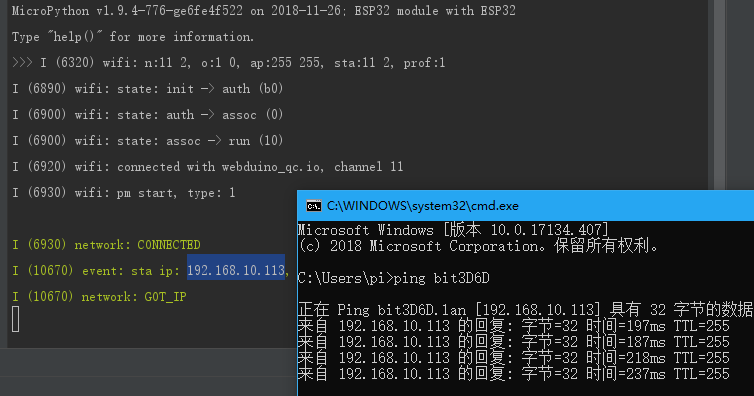
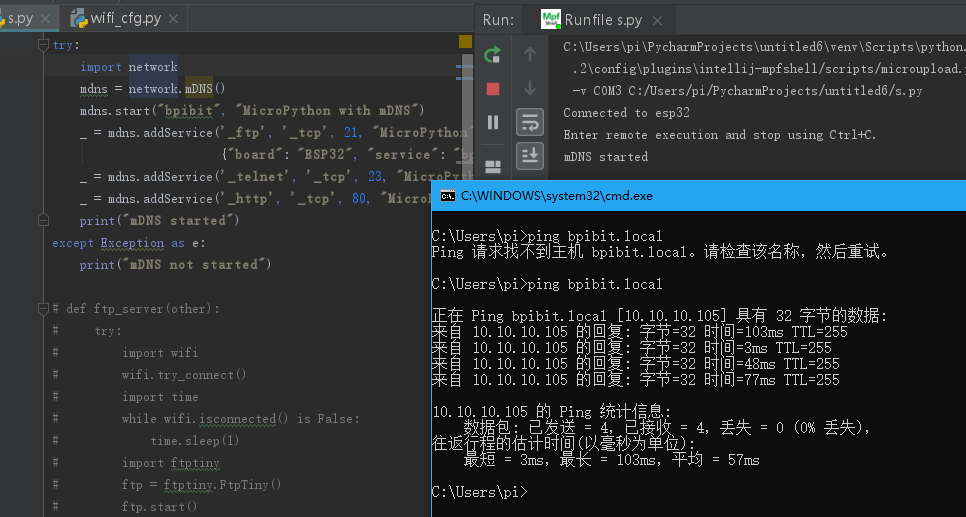
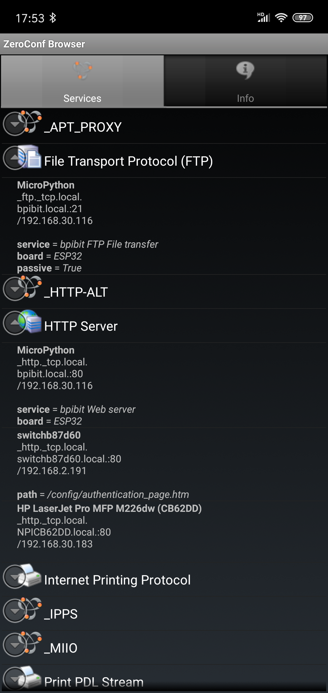

认识无线编程
=====================================================

使用有线的方式连接板子已经是上个世纪的特色了，所以我们在以后的开发过程中，是支持且尽量往无线控制的方向上出发的，因为各种简单物联网设备是不会特地留一个有线接口给你连接电脑控制的，例如：一盏智能控制的灯。

所以这时候无线就派上用处了，可以看到，在板子联网的时候，我们是可以不需要插入电脑的方式来直接帮助板子上网的，所以这便是无线的编程基础，要通过一个简单的方式让板子进入你所在的网络，你才能控制它。

远程连接板子
------------------------------------------------------

MicroPython 的交互接口使用的是 Python
REPL，也就是它本身就是一个可再次操作的系统运行环境，与以往的Linux不同，它的特点就是简单容易使用，我们不是本身就是在享受科技给我们带来的美好，如果说编程只会让工具变得难用，那为何还要继续编程呢？

REPL 是有线的时候常用的交互接口，而在无线上，则推出了
`WebREPL`_\ ，顾名思义，就是云端的 REPL ，如下图：

.. figure:: wireless/webrepl.png

可以看到它可以直接操作板子了，像过去的有线连接一样，响应速度非常快，和有线的感受差别不大。

但这样显然还是不够的，因为这个编辑器只能够用，但并不好用，所以我还专门在
mpfshell 适配了 webrepl 的，也就是说，基于 mpfshell 的 pycharm
插件，也同样支持 无线编程 ，那么，所有觉得好用的功能全都用上了，如下图。

.. figure:: wireless/pycharm.png

运行程序正常，但需要注意两者的路径设定不太一样。

1. webrepl 标准路径为 ``ws://192.168.30.116:8266``\ 。

2. mpfshell 的路径则为
    ``ws:192.168.30.116,1234``\ ，区别在于后者允许顺带密码，从而免去了连接认证。

至此，你已经可以像过去有线一样使用它了，如果期间出现任何问题，只需要重启板子即可，它会自动上电连接网络并打开
Webrepl 的支持服务。

未来将会使用电池供电的方式，脱离电脑供电，所以你可以完全脱离有线自由的控制它了，注意必要时刻需要降频至
80Mhz ，不然很快就会没有电的。

.. _WebREPL: http://micropython.org/webrepl

远程管理板子
------------------------------------------------------

虽然可以使用了 REPL 的方式去对板子进行编程控制了，但我们还需要一些额外的网络支持服务才能让我们的板子玩得更加愉快。

这里我简单介绍一下它们

FTP 标准文件系统操作服务
~~~~~~~~~~~~~~~~~~~~~~~~~~~~~~~~~~~~~~~~~~~~~~~~~~~~~~~~~~~~

使用以下代码即可启动 FTP 服务

.. code:: python

    import ftptiny
    ftptiny.FtpTiny().start()

.. figure:: wireless/ftp.png

WebDAV HTTP 文件系统服务（在 20190312 后固件暂时移除了）
^^^^^^^^^^^^^^^^^^^^^^^^^^^^^^^^^^^^^^^^^^^^^^^^^^^^^^^^

使用以下代码即可启动

.. code:: python

    import webdav
    webdav.start()

.. figure:: wireless/webdav.png

它和 FTP 不一样的地方就是使用的是 80 端口，访问的时候是用的 http，而不是 ftp。

.. figure:: wireless/webdav_index.png

Hostname local 域名服务
~~~~~~~~~~~~~~~~~~~~~~~~~~~~~~~~~~~~~~~~~~~~~~~~~~~~~~~~~~~~

这个需要特定的路由服务支持，例如：openwrt(linux)。

它允许你使用 hostname.lan （或直接 hostname）的方式代替 IP 来访问板子。

所以不需要再去记忆 IP 地址了，而是自己定义自己的板子名称。

hostname 保存在下图 wifi_cfg.py 文件中。

.. figure:: wireless/wifi_cfg.png

如图的 bit3D6D，访问方法和测试方法如下。

而如何使用呢？

.. figure:: wireless/hostname_demo.png

而你之后去其他地方更换网络了，也不需要更换 IP，只需要更换连接的 WIFI
配置就可以了。

MDns 反向域名解析服务
~~~~~~~~~~~~~~~~~~~~~~~~~~~~~~~~~~~~~~~~~~~~~~~~~~~~~~~~~~~~

如果你用不了 hostname 的方式来取代 IP 的记忆，除了请求云端服务商注册 DNS
域名解析外，那还有一个办法，就是反向注册 DNS ，DNS
本是服务端特有的管理服务，底下的客户端是不可以再改动的，所以呢，我们就使用主动申请的域名解析从而获得自己特定的域名。

说白了，就是把 IP 变成了 自定义的网络路径，例如：hostname.local。

如下示范，这也同样需要比较新的路由器支持，只要不是上个世纪的路由器，基本都支持了这个服务，但不否认
10 年之前产的路由器，可能都不一定带有这个 MDns
服务，包括电脑也不一定支持，Windows 需要额外安装 Bonjour Print Services
功能，可在\ `此处下载`_\ 。

现在我使用如下代码来配置板子拥有 Mdns 的注册功能（所有操作都是基于联网的条件下）。

.. code:: python

    try:
        import network
        mdns = network.mDNS()
        mdns.start("bpibit", "MicroPython with mDNS")
        _ = mdns.addService('_ftp', '_tcp', 21, "MicroPython",
                             {"board": "ESP32", "service": "bpibit FTP File transfer", "passive": "True"})
        _ = mdns.addService('_telnet', '_tcp', 23, "MicroPython", {"board": "ESP32", "service": "bpibit Telnet REPL"})
        _ = mdns.addService('_http', '_tcp', 80, "MicroPython", {"board": "ESP32", "service": "bpibit Web server"})
        print("mDNS started")
    except Exception as e:
        print("mDNS not started")

在电脑中可以使用 ``bpibit.local`` 替代 IP
地址访问它，如下图，你也可以取自己想要的名字，改掉代码里的
``mdns.start("bpibit", "MicroPython with mDNS")`` 即可。

.. _此处下载: https://support.apple.com/kb/DL999

但实际上不仅如此，还可以知道它提供了什么服务等等，我用了其他软件来查看，以下是手机中查看的结果，可以看到
MicroPython 对应的是 mdns.addService 的参数。

看图可以得知是我们注册的时候提供的信息，如 FTP 和 HTTP 服务。

Python 动态建立网站服务
~~~~~~~~~~~~~~~~~~~~~~~~~~~~~~~~~~~~~~~~~~~~~~~~~~~~~~~~~~~~

Webdav 实现的是静态的纯粹网站，并不适合利用后台的 Python
进行运算的网站服务。

所以在固件里提供了 `microwebsrv`_ 用以搭建 Python 动态网站。

这之后会专门出一个简单应用示例以做说明，它将类似 PHP
语言一样建立网站服务。

.. _microwebsrv: https://microwebsrv.hc2.fr/
