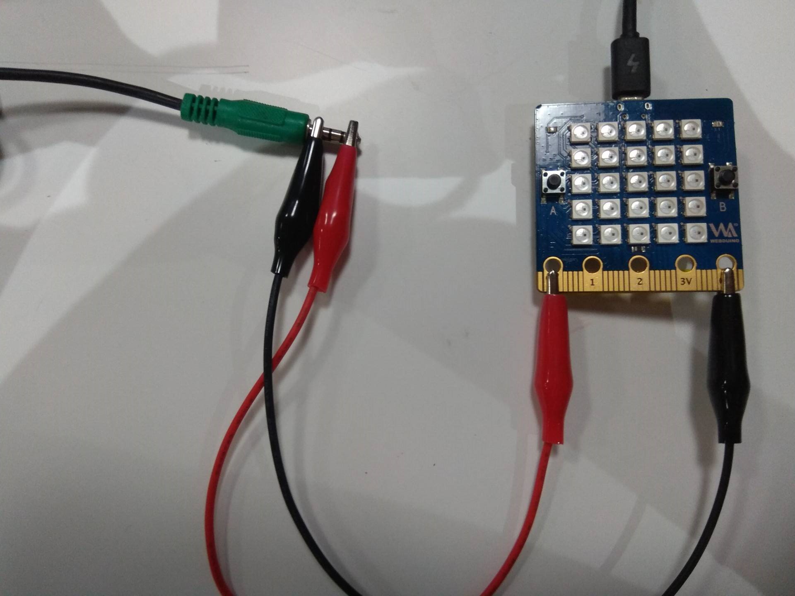
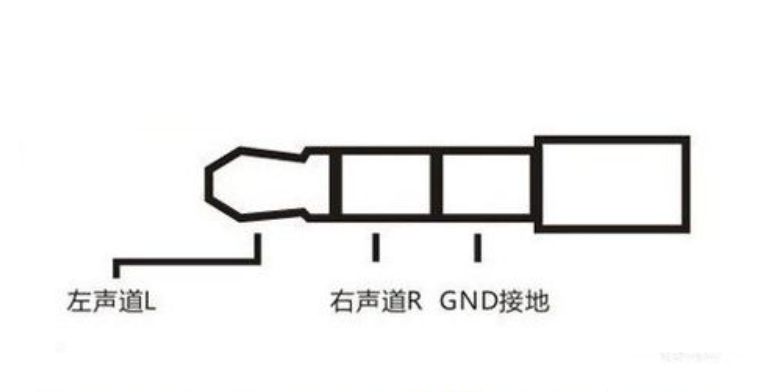

播放简单的音乐
=====================================================

我提供了一个 MIDI 播放功能模块，它可以对指定的 蜂鸣器 进行 PWM 输出，从而播放出音乐，虽然你可能并不需要知道这些。

咳咳，废话不多说，来点音乐，在板上已经预先接好了一个内置的蜂鸣器，其引脚位置为 25，如果你有一定的动手能力，可以之后来学习如何自己接一个 蜂鸣器 来播放音乐。

.. Attention::

        不要装压电式蜂鸣器，它只能播放单个声调。

使用代码如下（接口可参考 Microbit 文档）

.. code:: python

    import music
    music.play(music.NYAN)

可以看到有如下列表，这都是我们内置的音乐。

.. code:: python

        music.DADADADUM
        music.ENTERTAINER
        music.PRELUDE
        music.ODE
        music.NYAN
        music.RINGTONE
        music.FUNK
        music.BLUES
        music.BIRTHDAY
        music.WEDDING
        music.FUNERAL
        music.PUNCHLINE
        music.PYTHON
        music.BADDY
        music.CHASE
        music.BA_DING
        music.WAWAWAWAA
        music.JUMP_UP
        music.JUMP_DOWN
        music.POWER_UP
        music.POWER_DOWN

挑选一些出来听听，应该会有你喜欢的。

创作一首曲子
----------------------------------------

写下一段 Python 的列表
``["C4:4", "D4", "C", "E:8"]``\ ，就代表一段音乐。

这要如何理解呢？

可以认为每一个元素都是一个音符，它的格式满足如下：

.. code:: python

    NOTE[octave][:duration]

首先要有一丁点的乐理基本理解。

NOTE 指这一节点的音阶，通俗来讲，音乐里的 C D E F G A B 就是音阶，如 ``"C"`` 指 do，所以 C D E F G A B 就是 do re mi fa so la xi。

octave 指这一节点的八度，八度就是指音程关系，简单一点讲，就是你唱 1 2 3 4 5 6 7 1 （注释：1234567 对应的音名分别是CDEFGAB），第一个 1 就是最后一个 1 的低八度，最后一个 1 就是第一个1的高八度，低音到高音，越小就越低音。

duration 指这一节点的拍子数，简单理解为该节点音符播放持续的时间。

举例来说：

``"C4:4"`` 相当于 C（Do）在 4 （中音部分）的音符，接着 :4 指持续四个拍子，默认的拍子时长是 125 ms，即播放时长（duration）为 0.5 s。

如果你给节点 NOTE 命名为 R 那么在指定的时长里，喇叭就不会播放任何声音。

为了很好解释这些，我们来看如下一章节的案例。

.. Hint::

        music 模块默认的拍子定位为 ticks=4, bmp=120，ticks
        指某个音符的拍子类型缺省值，如：‘C4’ 且 ticks=4，相当于
        ‘C4:4’，意味着这个节点在 bpm 的基准下播放的时长，而 bpm
        指每分钟节拍数的单位，电子音乐当中正是依赖于用 BPM
        数值的高低来描述不同音乐的速率。

        根据公式可以算出基准的拍子 beats = 60(s) \* 000 / 120 / ticks
        ，如果是默认值，则拍子单位时长为 60000/120/4 = 125 milliseconds。

试试播放音乐
----------------------------------------

亲自试试这段代码吧。

.. code:: python

    import music
    music.play([ "C4", "D4", "E4", "F4", "G4", "A4", "B4", "C5"])
    music.play([ "D1", "D2", "D3", "D4", "D5", "D6", "D7", "D8"])

播放二只老虎
----------------------------------------

我们为了能够在板子上播放这首经典的两只老虎，准备了如下代码。

.. code:: python

    import music

    tune = ["C4:4", "D4:4", "E4:4", "C4:4", "C4:4", "D4:4", "E4:4", "C4:4",
            "E4:4", "F4:4", "G4:8", "E4:4", "F4:4", "G4:8"]
    music.play(tune)

而且神奇的是并不只会这样哦，它还可以进一步简化作曲过程，比如说，现在的节点
‘C4:4’ 将会影响到之后的八度配置，直到有新的替换。 所以你可以这样写：

.. code:: python

    import music

    tune = ["C4:4", "D", "E", "C", "C", "D", "E", "C", "E", "F", "G:8",
            "E:4", "F", "G:8"]
    music.play(tune)

是不是产生了同样的效果了呢？

特殊的声音效果
----------------------------------------

music 让你制作非音符的声音，比如下面这里我们就创建了一个警笛声

.. code:: python

    from microbit import *
    import music
    while True:
        music.pitch(range(880, 1760, 16), 15)
        sleep(50)
        music.pitch(range(1760, 880, -16), 15)
        sleep(50)

稍微注意了，music.pitch 方法是使用它的实例，它需要一个频率，440 的频率相当于一场用来调音的音乐会 a 的频率。

另外，在这个案例中，range 函数是被用作生成一个数字的值，这些数字定义了音调的音高，这三个参数分别分开始值，结束值，以及梯度值。因此，这里第一个 range 的意思是。创造一个频率值从 880 开始，以 16 的跨度递增到 1760 ，而至于第二个 range 是说创造一个 1760 以 16 的跨度来递减到 880 。这就使得我们可以发出 一上一下 像警笛一样的声音。

最后我们还使用了while Ture：它会让这个警笛声一直持续下去的，是不是很有意思呢？

动手连接你的音响
----------------------------------------

大家在使用板子播放音乐的时候有没有发现声音有点小呢，在这里我们向大家介绍如何把板子连接到音响，用音响来播放音乐，如下图所示

P0口连接音频线的左声道或者右声道，GND 连接音频线的GND

从网络上获取乐谱
----------------------------------------

第一次接触这种音乐的格式不懂乐理的同学可能就有点懵了。那有没有一种可以快速获取乐谱的方法呢？有网友专门制作了一个转换工具，可以自动生成音频格式的数据。那就让我们来试试用这个工具生成板子可以播放的音乐数据吧。

这个工具由 `fizban99`_ 制作。 https://github.com/fizban99/microbit_rttl

转换的工作是一个excel的文件来实现的，我们首先下载这个excel文件，\ `点击下载`_

我们有了转换的工具了，接下来就需要下载音乐源文件了,点击下面连接进行下载
`Zip file of Mixed Tunes 1 (450 tunes)`_ `Zip file of Mixed Tunes 2 (375
tunes)`_ `Zip file of Mixed Tunes 3 (10,000 tunes)`_ `Zip file of TV
Theme Tunes (50 tunes)`_ `Zip file of Christmas Tunes (70 tunes)`_

把下载的音乐源文件都解压，所有准备工作做好之后，打开我们之前下载的excel文件，你会见到像下面的界面。

.. image:: music/1.png

点击Open RTTTL tune file，它会自动弹出文件管理器，找到我们刚才解压的文件中的其中一个，选中要转换的音乐文件后，点击打开

.. image:: music/3.png

完成上面的步骤后我们就完成了转换的工作，点击 play 可以播放音乐文件，注意：这里的 Copy code 是使用不了的复制出来的是乱码，所以我们直接复制红框中的内容就好了

.. image:: music/4.png

复制转换出来的代码,就可以让板子播放音乐了

.. code:: python

    import music
    music.set_tempo(ticks=16, bpm=45)
    tune = ['D#6', 'D#', 'D#:2', 'F', 'G', 'G#', 'G#', 'G', 'F', 'F:6',
            'D:2', 'D', 'D', 'D', 'D#','F', 'G', 'G', 'F', 'D#', 'D#:6',
            'D#:2', 'D#', 'D#', 'D#', 'F', 'G', 'G#', 'G#', 'G', 'F', 'F:4']
    music.play(tune)

.. _fizban99: https://github.com/fizban99

.. _点击下载: https://github.com/fizban99/microbit_rttl/raw/master/rtttl2microbit.xlsm

.. _Zip file of Mixed Tunes 1 (450 tunes): http://www.picaxe.com/downloads/rtttl.zip

.. _Zip file of Mixed Tunes 2 (375 tunes): http://www.picaxe.com/downloads/rtttl2.zip

.. _Zip file of Mixed Tunes 3 (10,000 tunes): http://www.picaxe.com/downloads/rtttl3.zip

.. _Zip file of TV Theme Tunes (50 tunes): http://www.picaxe.com/downloads/rtttl_tv.zip

.. _Zip file of Christmas Tunes (70 tunes): http://www.picaxe.com/downloads/rtttl_xmas.zip
