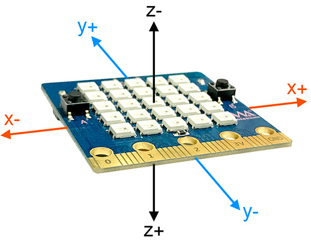
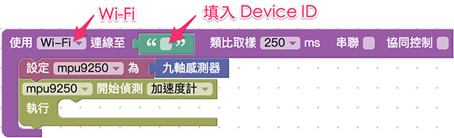
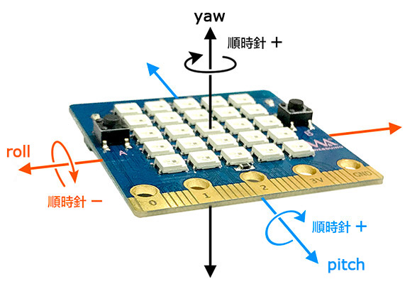
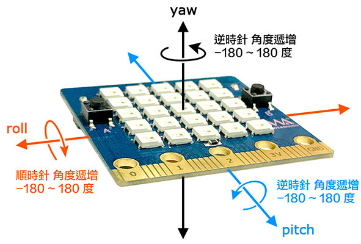
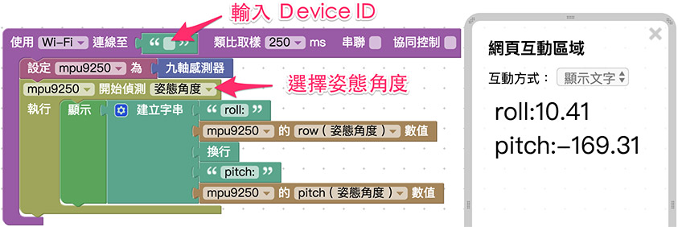

# 九轴传感器

Webduino Bit 内建一个九轴传感器，型号为 MPU-9250，除了可以侦测空间内的加速度与旋转，更能透过磁力计的辅助侦测，实现侦测姿态角度、指南针... 等进阶应用。

> 注意，使用九轴传感器需*将 Webduino Bit 更新至最新版本*，更新方式请参考：[Webduino Bit 初始化设定](setting.html#_top) 一文的「OTA 远程更新」

## 加速度计

加速度计主要侦测 x、y 和 z 三轴直线移动时「*瞬间*」加速度变化，要使用加速度计必须先了解加速度计在 Webduino Bit 中的方向，如下图所示，将开发板 5x5 全彩点矩阵朝上，金手指接脚朝向自己，*垂直上下的方向为 z 轴* ( 往上为负，往下为正 )，*水平左右为 x 轴* ( 往左为负，往右为正 ) *水平前后为 y 轴* ( 往自己的方向为负，远离自己的方向为正 )。

打开 [Webduino Blockly Bit 体验版](https://webduino.com.cn/link.html?lang=zh-hans&type=blockly)，在编辑区放入*开发板积木*，联机方式选择*Wi-Fi*，并输入 Device ID，接着在开发板内放入「*设定 mup9250 为九轴传感器*」的积木， 在其下方接着摆入「*mpu9250 开始侦测加速度计*」的积木。

使用显示文字的积木，同时显示 x、y 和 z 方向的加速度，点选右上方红色按钮执行，就会看见三个方向的加速度呈现在网页中，因为所在位置以及传感器初始化校准的不同，每块 Bit 在启用加速度侦测时，都会有些微的误差，但 Z 通常都会是负一千多 ( **单位为 mg**，1 g 通常为一个重力参数 )，X 和 Y 通常会在 200 ~ -200 之间，此时可以拿起 Webduino Bit 上下左右挥动，就会看见数值发生变化，由于所侦测的数值为「*加速度*」，因此 *当开发板没有移动或等速移动的时候，加速度会保持在一个稳定的数值区间内*。

> 提醒您，由于侦测的数值为「加速度」，在启动或停止的瞬间，*可能会产生反向的加速度* ( 就如行驶的公交车突然煞车或启动，乘客会往前倾或后仰 )，因此在开发时要透过一些逻辑判断来排除，或避免瞬间太大的启动与停止动作。

## 陀螺仪

加速度计主要侦测直线移动的瞬间加速度变化，而陀螺仪则是侦测旋转时「*瞬间*」的角度变化，如下图所示，将开发板 5x5 全彩点矩阵朝上，金手指接脚朝向自己，*绕着 z 轴旋转为 yaw* ( 顺时针旋转为正，逆时针旋转为负 )，*绕着 x 轴旋转为 roll* ( 顺时针朝自己旋转为负，逆时针旋转为正 ) *绕着 y 轴旋转为 pitch* ( 顺时针旋转为正，逆时针旋转为负 )。

积木组合方式和加速度计相同，只需将开始侦测下拉选单选择「陀螺仪」，点选右上方红色按钮执行，就会看见三个方向转动的角度变化呈现在网页中，因为是瞬间角度变化，所以当*停止转动后，会看到角度逐渐回归启动时的数值*。

## 姿态角度 ( 目前仅支持 roll 和 pitch )

有别于陀螺仪呈现的是「瞬间」角度变化，姿态角度表现的是实际转动的夹角，如下图所示，将开发板 5x5 全彩点矩阵朝上，金手指接脚朝向自己，*绕着 z 轴旋转为 yaw* ( 逆时针旋转角度递增，区间为 -180~180 度 )，*绕着 x 轴旋转 为 roll* ( 顺时针旋转角度递增，区间为 -180~180 度 ) *绕着 y 轴旋转为 pitch* ( 逆时针旋转角度递增，区间为 -180~180 度 )。

积木组合方式和加速度计相同，只需将开始侦测下拉选单选择「姿态角度」，点选右上方红色按钮执行，就会看见三个方向转动的角度变化呈现在网页中。

## 磁力计

磁力计主要可以计算出开发板在地球磁场空间内的数值，但主要会取决于所在地的经纬度，目前较无法提供一个准确的数值区间参考，因此使用上建议采用加速度计、陀螺仪或姿态角度来实现应用，积木组合方式和加速度计相同， 只需将开始侦测下拉选单选择「磁力计」，点选右上方红色按钮执行，就会看见三个数值呈现在网页中。