## Web:Bit 软件安装&使用方法

测试环境：Win10 家庭版 & WIN7 基础版

### 第一步，安装编程软件 

#### win10

点击链接 https://banana-pi.dev/Image/BPI-BIT/WebBitSetup.exe 下载软件。

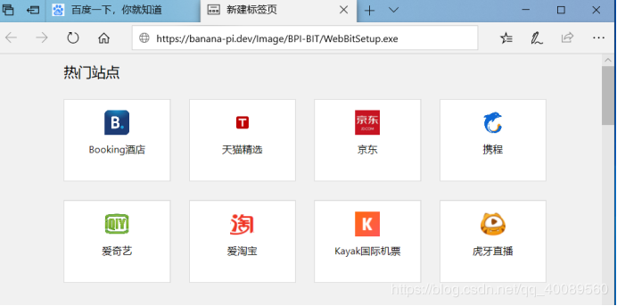

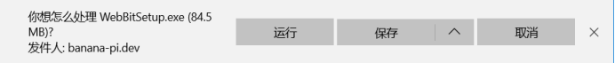

点击保存，然后打开软件位置，安装软件即可。
  
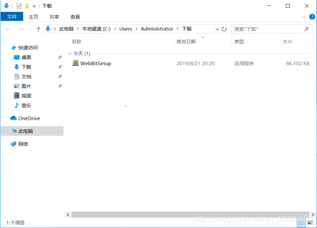

提示信息，可以忽略。（Win7 无提醒）

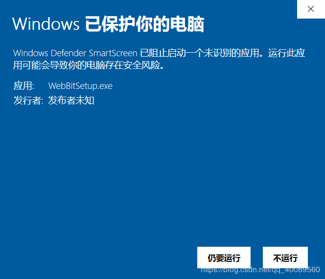

点击“仍要运行”进行安装。

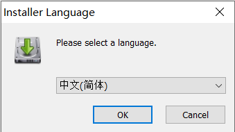

点击“OK”。

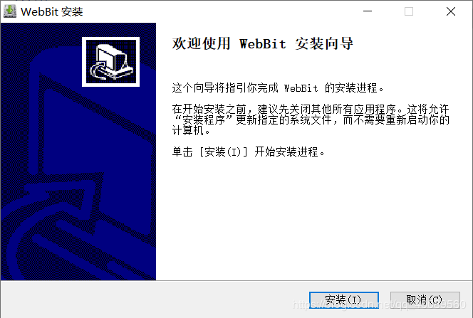

点击“安装”，等待安装。

安装成功，如下图，点击“完成”，软件就安装成功了。

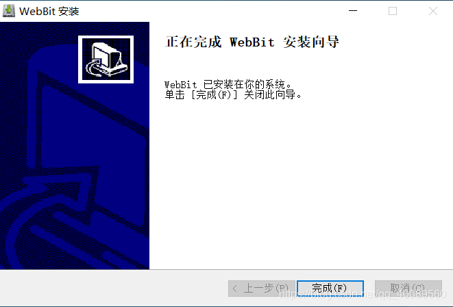

#### Win7

使用 360 浏览器下载软件。

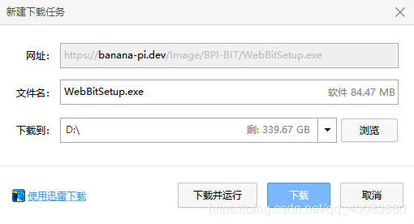

下载完成打开

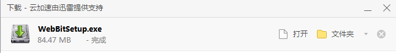

安装

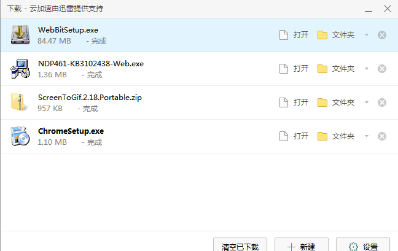

返回桌面就可以看到 Web：Bit 软件了

### 第二步，安装有线驱动

打开链接 [安装驱动](https://bpi-steam-docs.readthedocs.io/zh_CN/latest/bpi-steam/driver.html) 进入教程，或点击左侧目录 安装驱动 。

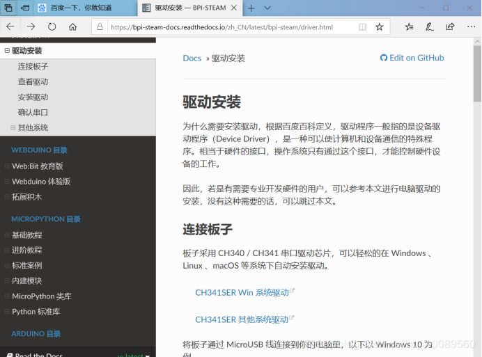

点击”CH341SER Win 系统驱动”，下载驱动。

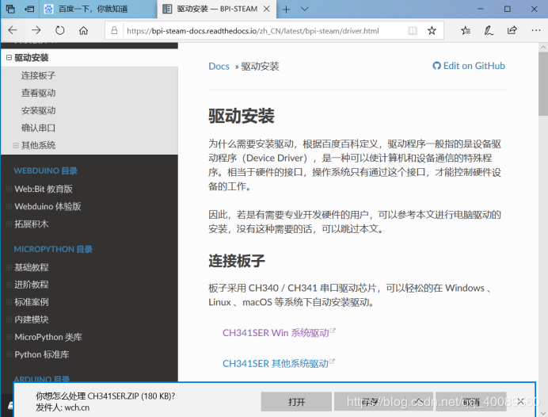

点击保存，打开文件位置，如下：

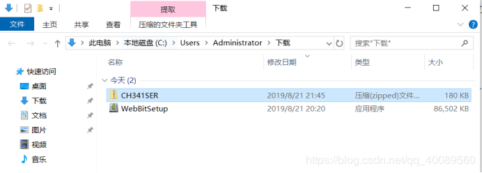

解压 CH341SER 文件

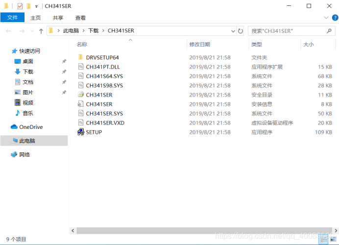

点击“SETUP”，进行驱动安装。

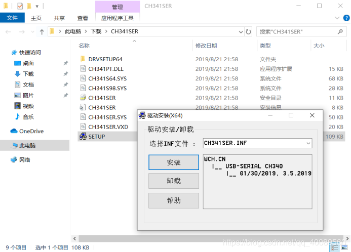

点击“安装”即可

### 第三步，有线连接板子

用 USB 数据线连接 BIT 板后，打开设备管理器，显示USB-SERIAL-CH340（COMX），这说明你已经成功安装驱动了。

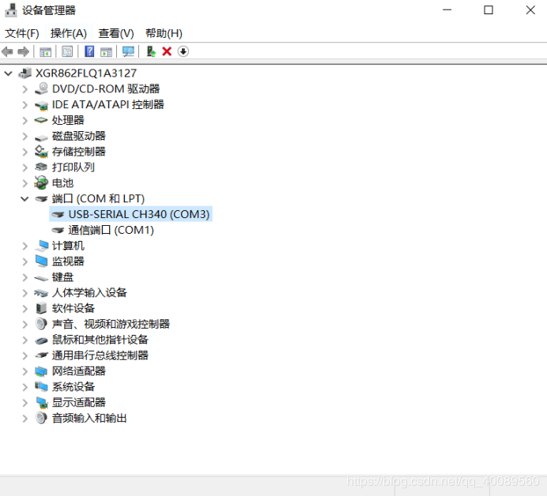

双击“webBit”图标，打开软件，如下。

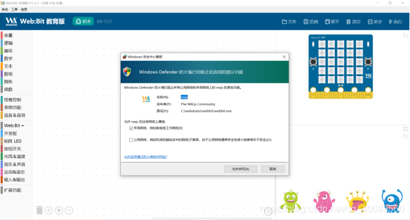

点击“允许访问”。

接下来就可以使用 BIT 板子开始积木编程了。

### 第四步，使用积木编程

#### 载入范例体验

打开 Web:Bit 看到整个界面

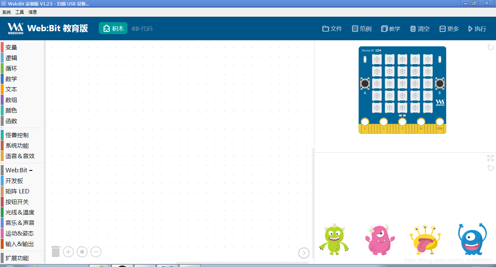

点击右上角范例,可以看到右下方小怪兽变化

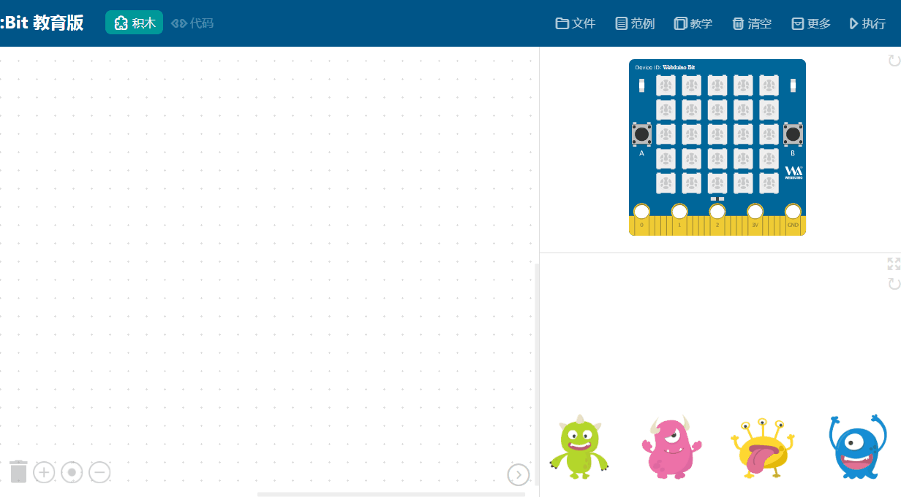

接下来看下模拟开发板的效果

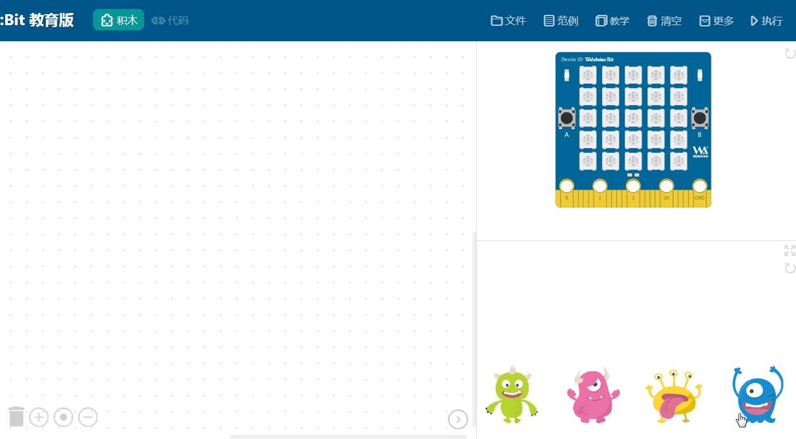

#### 控制实体开发板

使用 USB 线连接

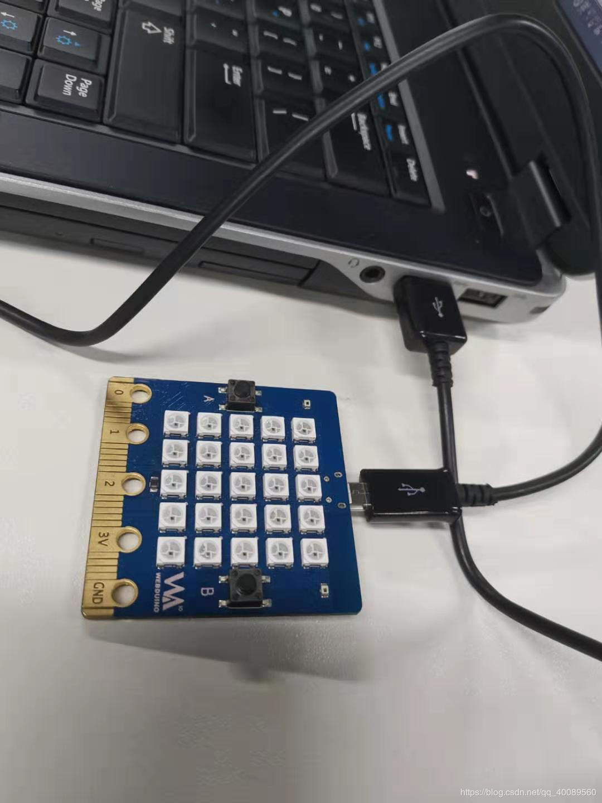

打开软件看右上方是否连接成功 

一直出现扫描 USB 设备则需恢复出厂固件。

更新完成后，需要设置服务器为中国 

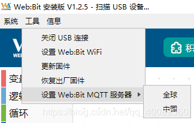

就能连接成功使用了，更多使用方法请继续往下看吧。
