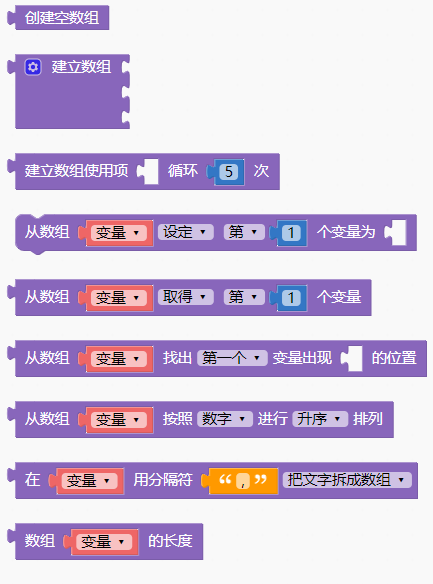
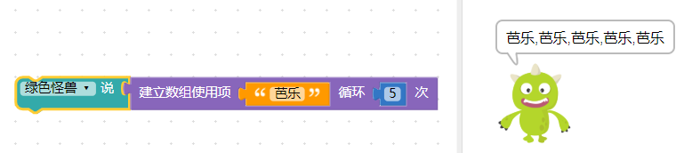
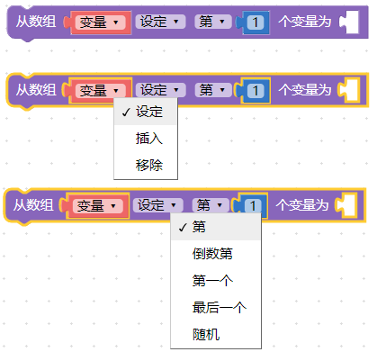
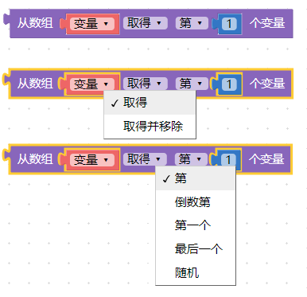
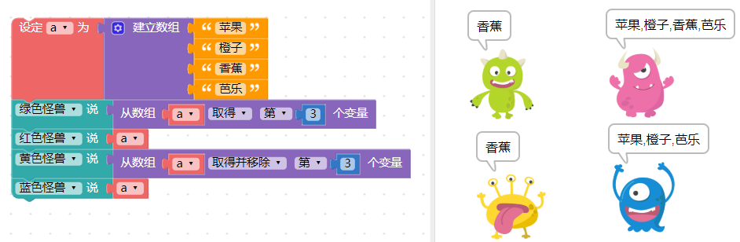
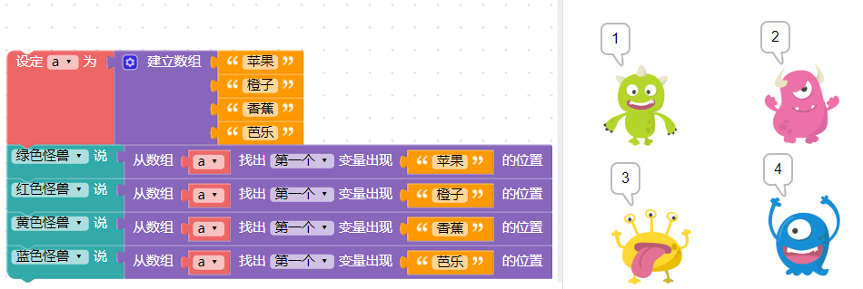

 <ul>
<li><table>
<thead>
<tr class="header">
<th>测试日期</th>
<th>测试环境</th>
<th>硬件版本</th>
<th>固件版本</th>
<th>软件版本</th>
<th>测试人员</th>
<th>测试结果</th>
</tr>
</thead>
<tbody>
<tr class="odd">
<td>2019年8月22日</td>
<td>Windwos7 &amp;Windwos10 &amp; browser</td>
<td>1.4</td>
<td>7NJfWecLminDsnEtpD</td>
<td>1.2.5</td>
<td>陈渊&amp;徐光发</td>
<td>通过</td>
</tr>
</tbody>
</table></li>
</ul>

## 数组

数组可以将数字、文字、列表或变量，按照顺序组合起来，这些按序排列的集合就称作数组，一个数组可以再细分为多个元素，或是一个数组内还包含其他数组，在进行比较复杂的运算时，也会通过数组的一些操作来实现。

### 数组积木清单

### 空数组

「空数组」积木会建立一个数组容器，也就是里面没有包含任何元素的数组。

如果要用变量进行数组的操作，首先必须把这个变量定义为数组或空数组，才能针对这个变量进行数组数值的添加、删除、编辑...等动作。

### 建立数组

「建立数组」积木可以在指定位置放入许多对应的内容，建立一个可以链接各类内容的数组。

点击蓝色小齿轮 ⚙ ，可以增加更多可放入内容的缺口。

这个数组建立完成后，可以试着让小怪兽讲出这个数组（数组的内容会用逗号分隔）。

或是可以使用下述积木，从数组中取出每个内容，并依序讲出数组内容。

### 建立重复内容的数组

「建立重复内容数组」积木可以建立具有重复内容的列表，内容可以是变量、文字、数字或数组，将其放入缺口内，就会根据设定的内容建立数组。

效果就是让「芭乐」文本词汇重复建立五次并添加到数组中，这时候绿色小怪兽就会念出五次「芭乐」。

### 设定数组内容

「设定数组内容」积木可以针对数组的内容 ( 第几个、倒数第几个、第一个、最后一个和随机 ) 进行三种编辑行为 (也就是设定、插入或移除 )。

举例来说，假设一个数组有四种水果苹果、柳丁、香蕉和芭乐，通过「设定数组内容」积木将数组中第一个水果元素换成莲雾，这时候 绿色小怪兽 讲出数组的第一个水果就变成了莲雾，然后试试移除数组的第二个内容，此时红色小怪兽讲出的数组就会变成只有三种水果（莲雾、香蕉和芭乐）。

接着使用「插入」文本桃子在「最后一个」，就可以看到数组又变成四种水果，最后一种是桃子。

### 取得数组内容

「取得数组内容」积木可以取得一个数组中某个元素的值( 第几个、倒数第几个、第一个、最后一个和随机)，或是取得某个元素的值之后，同时移除该元素。

如果单纯取得某个元素的值，并不会影响原本数组的内容和长度，但如果是「取得并移除」，这个数组就不再包含这个元素，例如一开始有四种水果，如果只是取得内容，取得内容后的数组依然是四种水果，不过如果取得后移除内容，取得内容之后数组就变成了只有三种水果。

### 寻找数组内容

「取得数组内容」积木能从一个数组中，找到特定元素所在的位置，并回传该位置的编号。

通过取得数组积木来取得水果数组，就能知道**苹果**位在第一个位置、**柳丁**位在第二个位置、**香蕉**位在第三个位置、**芭乐**位在第四个位置。

> 务必注意，如果是「代码」而非使用「积木」，第一个位置通常都是 0 ，第二个位置是 1 ，但是为了和生活习惯保持一致，在积木中的第一个位置的显示为 1 ，第二个位置为 2 ，以此类推。

### 数组排序

「数组排序」积木会将指定的数组内容按字母、数字的规则进行排序，排序后会得到一个新的数组，*不会影响原本数组的内容*。

从下图的例子可以看出，绿色小怪兽会讲出按照字母排序过后的水果数组( a, b, c, .... )，而红色小怪兽讲出原本的水果数组并没有受到数组排序积木的影响。

如果选择字母排序，就会「*先按照字母大小写排序，大写在前，小写在后，排序后再按照第二个字母排序*」，如果选择不区分大小写，就会直接进行排序，「 *如果第一个字母相同，就用第二个字母排序*」，以下图的例子，大写 A 在前，小写 a 在后，排序后再按照 123、456 进行排序。

### 文本与数组转换

「文本与数组转换」积木可以将带有「分隔符」( 类似空白、逗号、分号...等分隔符号 ) 的文本转换为数组，或是将数组合并为一段文本。

如果一段文本没有变成数组，其中第二个元素就会是第二个字( 绿色小怪兽就会讲出「果」 )，如果将文字拆分为数组，第二个元素就会是数组中的第二个内容( 红色小怪兽就会讲出「橙子」 )。

反之如果是将数组合并为文字，可以将分隔符留空，就会看见数组的内容变成一整串的文本，中间不会有逗号分隔，如果带有分隔符( 例如 a )，就会看见结合成的文字中间都有 a 。

### 数组长度

「数组长度」积木可以取得数组中内容的总数，如果是空数组则数组长度为 0 。

因为数组长度表示的是「数组的缺口数」( 数组可以放入多少个元素)，所以如果「有缺口」但没有放入元素，仍然会影响数组长度，例如有个四格缺口的数组，但只放入了三种水果，最后呈现出来的数组长度是 4 。

