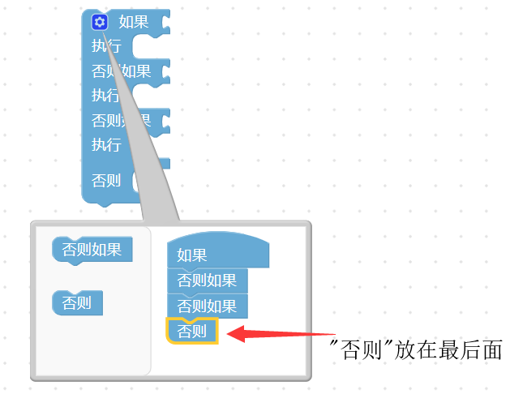
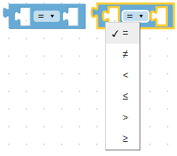
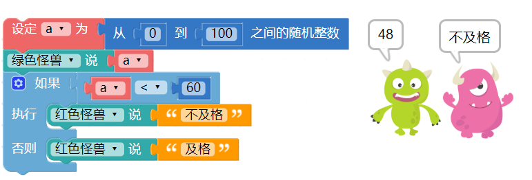
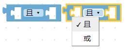
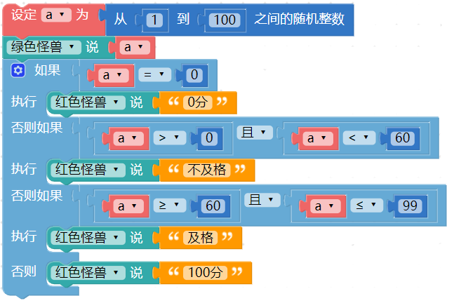
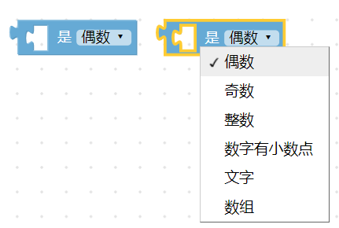
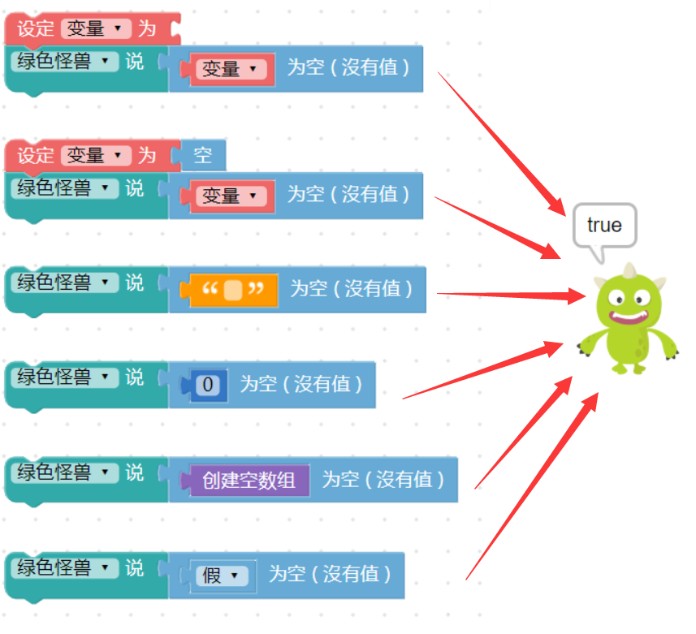
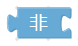
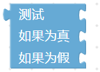

## 逻辑

逻辑是很多的条件和判断，当满足了某些条件就会执行某件事，例如听见闹钟响就该起床、看到绿灯才可以通过...等情况，就是一些简单的逻辑判断。在日常生活里，无论是写程序、数学计算，还是法庭辩论，甚至是路上交通、买卖东西或要不要起床，都包含许多「逻辑」的成分，

### 逻辑积木清单

逻辑的积木由一个主要的积木「如果...执行...」( 前方有蓝色小齿轮的积木)，分别搭配九种逻辑判断的积木( 判断、逻辑运算、数字型态、空值、包含值、真假值...等)组成。

### 逻辑判断

「逻辑判断」积木预设有两种型态的组装「缺口」，在上方比较小的是「条件判断」 如果，下方比较大的是「执行内容」 执行，代表着*如果情况满足上方的条件判断( 判断返回值为「真」或「ture」 )，就会执行对应的内容*。

点选左上方的*蓝色小齿轮*，可以新增逻辑判断的条件，点一下可以打开，再点一下关闭。

逻辑条件判断有三种：*「如果」一定是在第一层，「否则如果」在中间，「否则」一定在最后*，「否则」的条件判断表示当「如果」和「否则如果」的条件都没有满足，就会执行「否则」的内容。如下图

如果只有*两个条件*，例如非 A 即 B，只需使用「如果」和「否则」就可以。

### 条件判断式

条件判断式主要会放在逻辑的「条件判断」缺口内，提供不同情境的逻辑判断，判断的条件主要分为：等于(=)、不等于(≠)、小于(<)、小于等于(≦ )、大于(>)、大于等于(≧)。

用法：只要把条件判断式的积木，放到判断条件的缺口内即可。如下图

举例来说，可以先新增一个变量a 为0 到100 之间的随机整数，并让绿色小怪兽讲出数字，接着用逻辑判断，如果变量a 小于60 ( 返回判断为「真」(true) )，就让红色怪兽讲「不及格」，否则就讲「及格」，执行程序后就能看到对应的结果。

### 逻辑运算符

「逻辑运算符」积木为逻辑判断提供了更弹性的条件判断，当中包含了「*且*」与「*或*」，如果使用「且」，在两端判断的条件必须都满足时，才会执行动作，如果使用「或」，只要满足其中一个条件就会执行动作。

通常当逻辑判断里出现「如果.否则」的时候，就会用到逻辑运算符，而逻辑运算符常常和条件判断的积木搭配使用。 ( 有时也会遇到只有「否则如果」搭配逻辑运算符的情况 )

以刚刚的例子来说，可以增加到四个条件判断，分别是 0、1~59、60~99 和 100，当条件判断成立时，就会让小怪兽说出数字以及对应的文字。

### 判断数字型态

「判断数字型态」积木可以帮助我们快速判断*奇数、偶数、整数、数字有小数点、文字和数组*。

用法：只需直接放入条件判断的缺口内即可。如下图

例如我们可以设定变量 a 为两个随机数相除，再通过小怪兽讲出整数或小数。 ( 除法的积木使用了「多行输入」，可以在积木上按右键选择多行输入，教学参考：[程序积木小技巧](../info/software.html#id8)

### 判断空值

「判断空值」积木主要是和「数组」积木搭配，*如果是空值返回「真」(true)，否则返回「假」（false）*。

会产生空值有几种情况：「*无文字、数字0、空数组、空值、「假」（false）、没有值的变量*」，如果满足这几种情况，就会返回「真」(true) 。

### 判断是否包含文字

「判断是否包含文字」积木可以检查某段文字内，是否*包含*了指定的文字或文字段落。

举例来说，如果检查「你是我的小呀小苹果」里面有包含「小苹果」，绿色怪兽就会说「找到小苹果了」，反之如果是「小柠檬」，红色怪兽就会说「没有小柠檬」。

### 非

「非」积木就如字面一样，表示「否」，通常会和「真/假」或「空值」的积木搭配使用。

如果把积木接在「非」的积木后面，状态就会反过来，例如空就会变成非空（不是空的）、真就会变假，假就会变真，以此类推。

### 真/假

「真/假」积木主要表示「真」(true) 与「假」（false） 两个值，目的在判断的时候，在数字、文字之外，多一些判断的条件。

### 空

在写程序的时候，有时候会遇到某个变量或是某个数值变成空值 ( null )，这时就可以使用空值的积木判断，用法和「真/假」的用法类似。

### 三元逻辑运算符

「三元逻辑运算符」积木是针对只有「*两种条件*」的问题，并针对根据条件传回「两个运算式」的其中一个。

比如上面提到的及格与不及格的例子，因为只有两种条件，就可以通过三元逻辑运算符来轻松实现，且还可以使用比较少的积木来完成同样的结果。

### 测试报告

<table>
<thead>
<tr class="header">
<th>测试日期</th>
<th>测试环境</th>
<th>硬件版本</th>
<th>固件版本</th>
<th>软件版本</th>
<th>测试人员</th>
<th>测试结果</th>
</tr>
</thead>
<tbody>
<tr class="odd">
<td>2019年8月22日</td>
<td>Windwos7 &amp;Windwos10 &amp; browser</td>
<td>1.4</td>
<td>7NJfWecLminDsnEtpD</td>
<td>1.2.5</td>
<td>陈渊&amp;徐光发</td>
<td>通过</td>
</tr>
</tbody>
</table>