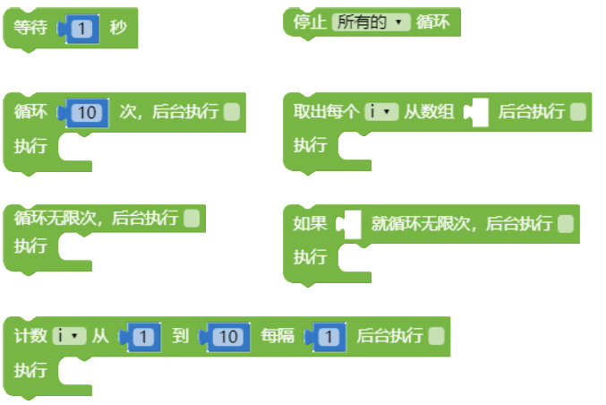
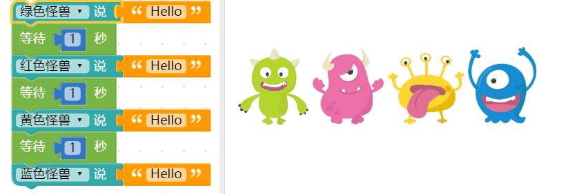
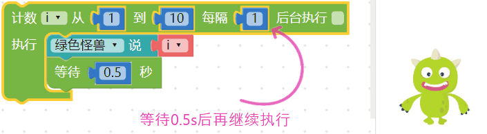
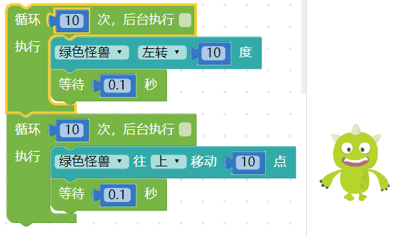
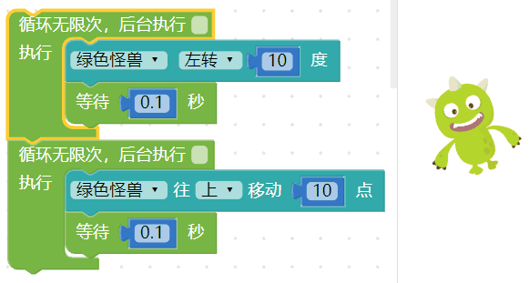
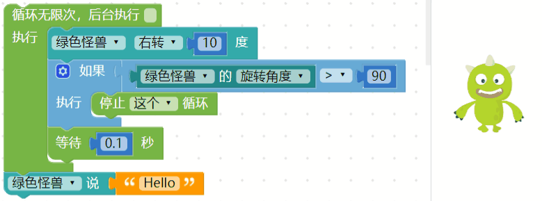

- | 测试日期      | 测试环境          | 硬件版本  | 固件版本           | 软件版本 | 测试人员      |测试结果 |
  | ------------- | ----------------- | --------- | ------------------ | -------- | ------------- |----------- |
  | 2019年8月22日 |  Windwos7 &Windwos10 & browser |  1.4 | 7NJfWecLminDsnEtpD | 1.2.5   | 陈渊&徐光发 |通过 |

## 循环

在程序领域里，循环 是常常使用的基本功能，循环就是循环执行程序，将需要循环执行的积木放在循环积木内，就能循环指定次数、延迟循环时间，或是执行无限次循环积木。

### 循环积木清单

循环的积木分别有一个「等待」的积木，五个不同循环模式的积木和一个「停止循环」的积木。

### 等待

「等待」积木可以让程序暂停一段指定的时间，当程序积木里遇到「等待」积木，就会等待指定的时间之后才会进行后面的动作。

以下方的例子来说，如果不加上「等待」，四只小怪兽会同时说出 hello，如果加上等待 1 秒，四只小怪兽就会以每隔一秒时间，依序说出 hello。

- 没有加上「等待」积木

 
 > 注意，上述所谓的「同时」，是针对人类肉眼来说的意思，对于程序而言仍然是按照顺序进行，只是间隔时间非常短，短到人类的肉眼分辨不出来
 
- 加上「等待」积木

### 循环执行几次

「循环执行几次」积木，可以指定循环内的积木所循环的次数，积木预设次数为 10 次。

通过循环10次，可以让小怪兽旋转 100 度。

延续前面介绍过的「等待」，如果在循环里头不加入「等待」，就会看见怪兽瞬间旋转了100 度，如果我们再加上等待0.5 秒的积木，就会看到怪兽每隔0.5 秒旋转10 度，旋转十次。

### 计数循环

「计数循环」积木有点类似「循环执行几次」积木的进阶版，差别在于计数积木使用了一个变量，通过改变这个变量的数值，来决定循环几次、如何循环以及循环的间隔。

> 如下图,因为内含一个变量，所以当编辑画面里有计数的积木，在变量的目录下也会出现一个对应的变量i。

使用「计数循环积木搭配等待」，可以让绿色小怪兽每隔0.5 秒讲出变量i 的数值，这个变量i 会*根据我们指定的起始数值、最终数值和间隔作数值进行递增或递减*，以下图的例子而言，变量i 会每隔0.5s 进行加1，直到变成10 为止( 也就会依序念出1234...10 )。

> 注意，*如果要「依序」念出数字，一定要加上「等待」的积木*，不然就会呈现最后的数字。

### 循环无限次

「循环无限次」积木会无止尽的一直执行循环积木内容，除非使用「停止循环」积木，循环的事件才会停止。

延续前面介绍过的等待，在「循环无限次」的积木内加入「等待」，搭配小怪兽的旋转，就可以让小怪兽不断地旋转。

### 判断为真，就循环无限次

「判断为真，就循环无限次」积木等同于「循环无限次」积木加上「逻辑」判断，*只要 如果 后面缺口的逻辑判断为「真」( true )，就会开始进行无限循环*。

举例来说，我们可以先设定一个变量 a 为 2 到 9 之间的数字，透过判断如果 a 是偶数，就让小怪兽开始旋转，否则就不旋转。

上面的例子也可以使用「逻辑」搭配「循环无限次」来实现同样的效果。

### 取数组元素并执行

有别于上述的循环方式，「取出数组元素并执行」积木是以数组长度作为循环次数的依据，因此数组后面缺口内必须放入数组积木，执行后就会依序取出数组内容并执行对应动作。

如下图，我们可以设定变量 a 为一个数组，里头放入五种水果名称，接着设定一个变量 i，依序让变量 i 等于水果名称，再让小怪兽讲出水果名称并进行旋转的动作。

### 后台执行

「后台执行」是所有循环积木里头的功能选项，由于程序码的执行顺序缘故，「**前一段程序尚未完成前，无法执行下一段程序**」，也因此*大多数的情况在画面上只能执行一个循环*，然而后台执行**可以同时使用多个循环**。

举例来说，如果我们使用两个「循环十次」的积木，都*不勾选后台执行*，第一个放入小怪兽旋转，第二个放入小怪兽移动，网页执行后，就会看到小怪兽*先旋转再移动*。

如果我们把上面例子中的循环积木，*都勾选后台执行*，网页执行后就会发现小怪兽*一边移动一边旋转*。

是否有后台执行，在「循环无限次」的情况下会更容易发现差异，**如果画面中有两个无限次的循环，如果没有勾选后台执行，因为行为还停留在前一个无限次循环，在后面的循环就不会执行**。

### 停止循环

上述所有的循环行为，都可以通过「停止循环」积木来停止，停止循环又分成「*停止画面上所有循环*」，或「*放在循环内，停止所在位置的循环*」。

例如在「循环无限次」积木里加入「小怪兽旋转角度大于 90 度就*停止这个循环*」的判断，就会在小怪兽角度大于 90 度时停止循环，继续执行下方的讲话程序。

如果有多个循环，也可以使用「停止所有循环」来停止，例如下方的程序，当小怪兽旋转角度大于 90 度，就会停止所有循环。 ( 此处勾选了后台执行，请参阅「[后台执行](loop.html#id9)」章节 )

