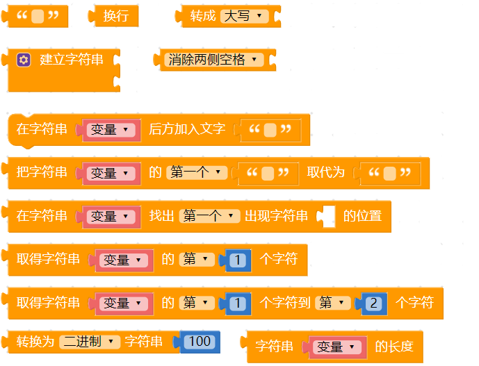
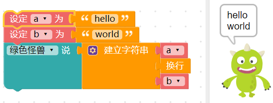
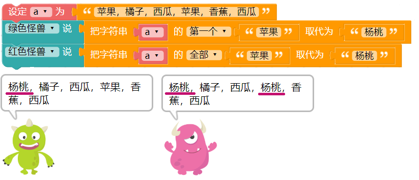
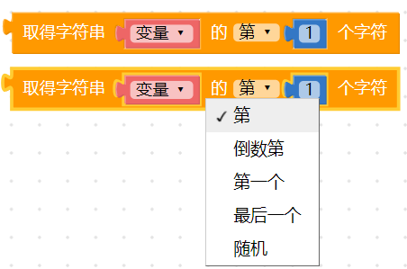
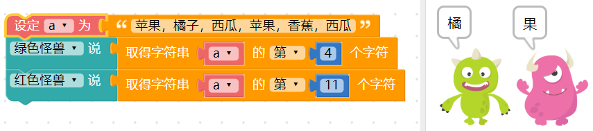
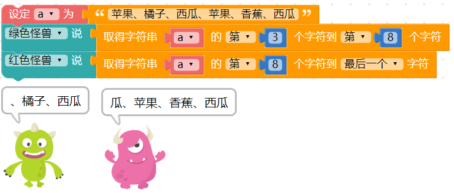
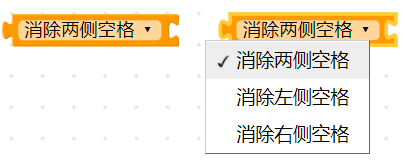
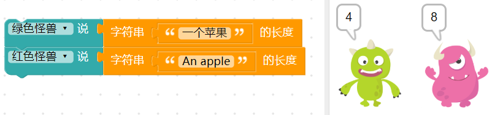

## 文字

文字积木除了可以显示有意义的词汇，也可以通过相加的方式把文字组合成文本（文本是由文字组成的），或是在一段词汇文本中寻找对应的字词或字母。

在编程的领域中，文字即字符，字符是指计算机中使用的字母、数字、字和符号，文本即字符串，字符串是由一串字符组成。

### 文字积木清单

文字积木分别有指定文字、换行、转换大小写、建立字串、文字工具、文字查找、文字取代、文字转换...等常用的文字功能。

### 指定文字

「指定文字」积木可以输入指定的文字，以便其他积木使用。

例如在小怪兽讲话积木后方接上指定文字，输入 hello，执行后小怪兽就会说出 hello。

### 换行

「换行」积木可以将一段文字从指定的位置换行。

### 建立文本

「建立文本」积木可以把不同的文字积木组合成一段文本。

点击蓝色小齿轮，通过拖拉组合可以增加文字缺口。

在文字缺口内放入指定的文字积木或是换行积木，就可以让文字组合出想要显示的文本。

建立文本也可以用来组合两个变量，例如变量 a 为 hello，变量 b 为 world，通过建立文本就能将两个变量组合为中间换行的 hello world。

### 在变量后方加入文字

「在变量后加入文字」积木能够改变原本变量的内容，使原本变量的内容后方额外增加文字。

因为是以「变量」为主，所以如果要让小怪兽讲话，就变成是使用变量的方式呈现。

### 取代文字

「取代文字」积木可以快速将一段文字里的某些字，替换为其他的文字，下拉选单可以选择更换第一个指定的文字，或所有指定的文字。 (取代文字不会对变量进行变更，而是产生一段全新的文本)

下图的例子可以只更换第一个「苹果」为「杨桃」，或是更换所有的「苹果」为「杨桃」。

### 寻找文本出现位置

「寻找文本出现位置」积木可以在一段文本中找出指定文本出现的位置，可以选择第一个出现的位置或最后一个出现的位置。

文字出现的位置是以「字数」来判断，以下图的例子，橘子的「橘」位于整段文字的第4 个位置，所以出现的数字为4，苹果的苹出现在第10 个位置，如果换成英文，orange 的o 位于第8 个位置，banana 的b 位于第16 个位置(逗号后面还有一个空格，空格算一个字符)。

### 取得指定位置的文字

「取得指定位置的文字」积木会取出文本中指定位置的文字，下拉选单共有五种指定位置，分别是第几个、倒数第几个、第一个、最后一个和随机位置。

以下图的例子，第 4 个字是橘，第 11 个字是果。

### 取得指定区间的文本

「取得指定区间的文本」积木会取出一段指定区间内的文本，需注意的是*第一个空格的数字要比第二个空格内的数字小*。

以下图的例子，第 3~8 的文字为「、橘子、西瓜」，而第 8 到最后的文字为「瓜、苹果、香蕉、西瓜」。

### 转换大小写

「转换大小写」积木可以针对「英文字母」进行大小写转换，包含全部转大写、全部转小写或是首字母大写。

以下图的例子，可以全部转换为大写，或是只有第一个 A 是大写。

### 消除空格

「消除空格」积木可以消除一段文字中左边、右边或左右两边的空格。

### 进制转换

「进制转换」积木能把数字转换为二进制、八进制、十进制或十六进制的数字。

例如数字 200 转换为二进制就是 11001000，转换为八进制就是 310，转换为十六进制就是 c8。

### 文字长度

「文字长度」积木可以取得一段文本的总字数，需要注意的是英文字以「字母」为单位，且空格也算是一个文字。

以下图为例，「一个苹果」的文字长度为 4，「An apple」因为包含空格，所以文字长度为 8。

