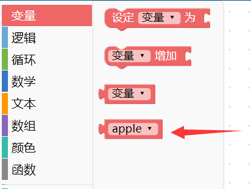
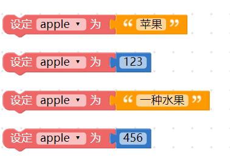
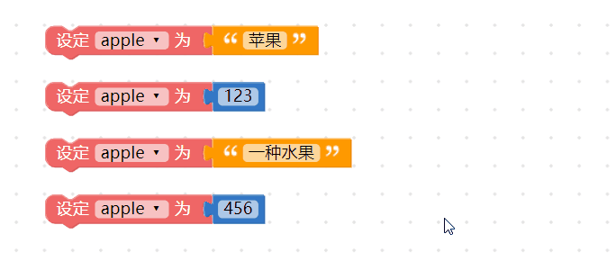
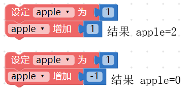
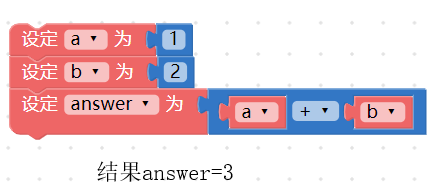

<table>
<thead>
<tr class="header">
<th>测试日期</th>
<th>测试环境</th>
<th>硬件版本</th>
<th>固件版本</th>
<th>软件版本</th>
<th>测试人员</th>
<th>测试结果</th>
</tr>
</thead>
<tbody>
<tr class="odd">
<td>2019年8月22日</td>
<td>Windwos7 &amp;Windwos10 &amp; browser</td>
<td>1.4</td>
<td>7NJfWecLminDsnEtpD</td>
<td>1.2.5</td>
<td>陈渊&amp;徐光发</td>
<td>通过</td>
</tr>
</tbody>
</table>

## 变量

变量，是所有程序都会用到的基本元素，使用前会赋予变量一个名称，接着就可以用这个变量来表示文字、数字、数组、颜色或逻辑。

### 新增变量

使用变量的第一步，就是「新增一个变量」，打开编辑器，将「*设定变量为*」的积木拖拉到积木编辑区中，下拉选单选择「*新变量*」，点选后弹出对话视窗，输入新变量的名称即可新增一个变量。如下图 ( 建议变量的命名尽可能以「英文 + 数字」为主 )

在新增的变量后方加上对应的值 ( 值可以是文字、数字、数组、颜色或逻辑 )，这个变量就等同于这个值，如果没有赋予值，这个变量就是空变量。

新增变量后，在左侧积木清单的变量目录下，也会看到新增的变量积木。

> 注意，如果在编辑画面里完全没有「设定变量为 XXX」的积木，积木清单里就不会看见 XXX 的变量积木。

### 设定变量

设定变量表示赋予变量一个值，使用方式和新增变量完全相同，由于程序语言有「*后面覆盖前面*」的特性，所以*如果变量名称相同，后面设定的值会覆盖掉前面设定的值* ，以下图的例子而言，变量apple 最后的值为456。

### 重新命名变量

区别于「新增变量」，重新命名变量可以将画面中所有相同的变量统一改名，例如画面里出现了四次 apple 的变量，通过重新命名，可以将四个 apple 变量名称全部换成 ball。

### 变量增加

变量增加表示「*让变量的值增加多少*」，假设原本变量的值为 1 ，使用变量增加 1 之后，这个变量就会加 1 变成 2 ，同理，如果使用变量增加 -1 ，那么这个变量就会加（-1）变成 0 。

注意，如果是不同类型的改变，例如原本的变量是文字「苹果」，却增加 数字「1」，最后得到的结果是「苹果1」三个字，同理如果变量是数字「1」，而增加文字「苹果」，得到的结果是「1苹果」。

### 使用变量

新增变量或设定变量完成后，就可以在积木编辑区中使用变量，以下图为例，先设定a 变量为1，b 变量为2，接着就能计算a + b 或a ÷ b 之类的数学运算，或进行判断a 和b 哪个值比较大的逻辑判断。当程序逻辑越来越复杂，就得通过变量来操作。

