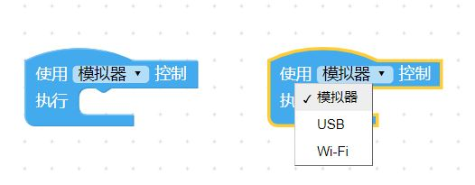
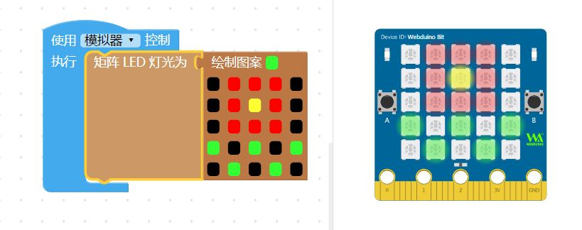
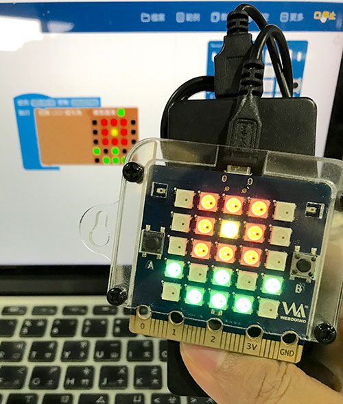
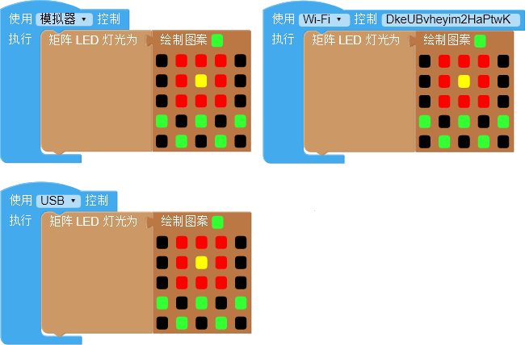

    
## 开发板

这里提供了三种控制开发板的方式，分别是「模拟器」、「USB」和「Wi-Fi」，模拟器能够在没有硬件的情况下模拟硬件，USB 可以在没有网络的情况下，通过 USB 连接操控。而Wi-Fi 则可以进行无线远程操控板子，通过三种不同操控方式的互相搭配，可以在各种场景下控制开发板。

### 使用方式

下拉选单选择「模拟器」，表示*使用右侧的「虚拟开发板」*，开发板积木里所有能控制的元件，都会和右侧的虚拟开发板对应，例如绘制一个图案，执行后，虚拟开发板就会显示图形。

下拉选单选择「USB」，表示*使用「USB 线」连接「开发板」*，**必须使用「编辑器（安装版）」操作**，例如绘制一个图案，执行后，通过 USB 连接的开发板就会显示图案。

> 「编辑器（安装版）请参考：[编辑器介绍](../info/software.md)

下拉选单选择「Wi-Fi」，表示*使用「Wi-Fi」连接「开发板」*，也就是通过**每块开发板的 Device ID 进行控制**，只要知道 Device ID，不论开发板身在何处，都能远程操控。

> 开发板 Device ID 请参考：[开发板设置](../info/setup.md)

### 控制多块开发板

编辑器可*同时控制多块开发板*，只需要在编辑画面里放入开发板，指定开发板的操控方式，执行后就会看到所有开发板同时发生变化，下图的例子，在同一个编辑画面里，让一块模拟器开发板和两块Wi-Fi 开发板，同时呈现花朵图案。

> 多块开发板 *最多只能包含一块「模拟器」开发板和一块「USB」开发板，「Wi-Fi」开发板则没有数量限制*。

在控制多块开发板的情况下，**不支持使用函数控制**，要特别注意！

但不可以在多个开发板中使用 函数 控制硬件外设，如下图。

因此若是想要做到同样的效果，此时的做法应该要如下：

### 测试报告

<table>
<thead>
<tr class="header">
<th>测试日期</th>
<th>测试环境</th>
<th>硬件版本</th>
<th>固件版本</th>
<th>软件版本</th>
<th>测试人员</th>
<th>测试结果</th>
</tr>
</thead>
<tbody>
<tr class="odd">
<td>2019年8月23日</td>
<td>Windwos7 &amp;Windwos10 &amp; browser</td>
<td>1.4</td>
<td>7NJfWecLminDsnEtpD</td>
<td>1.2.5</td>
<td>陈渊&amp;徐光发</td>
<td>通过</td>
</tr>
</tbody>
</table>
