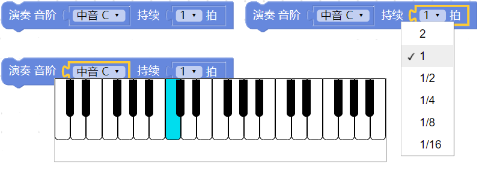
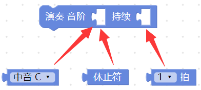
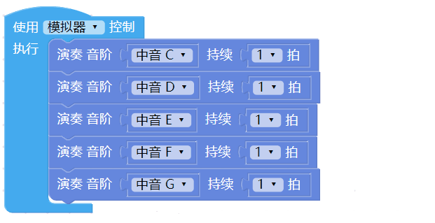
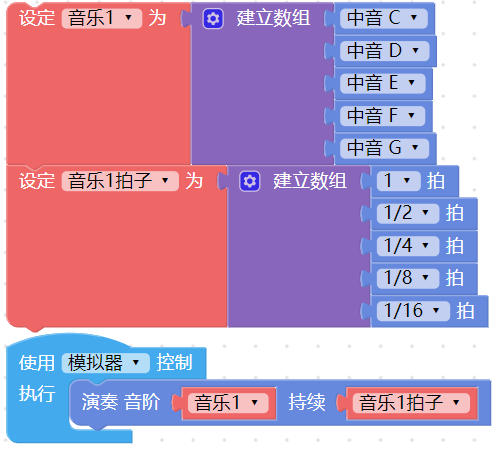
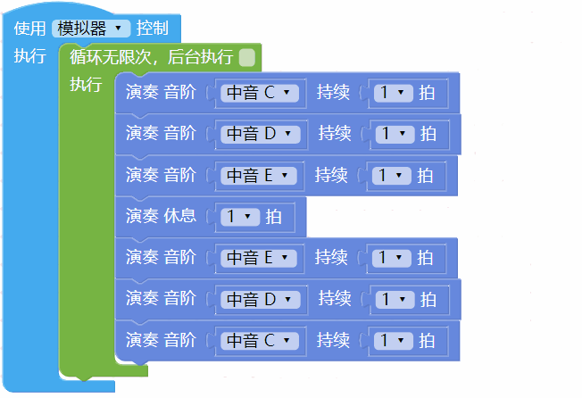
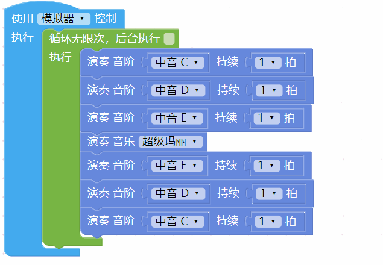
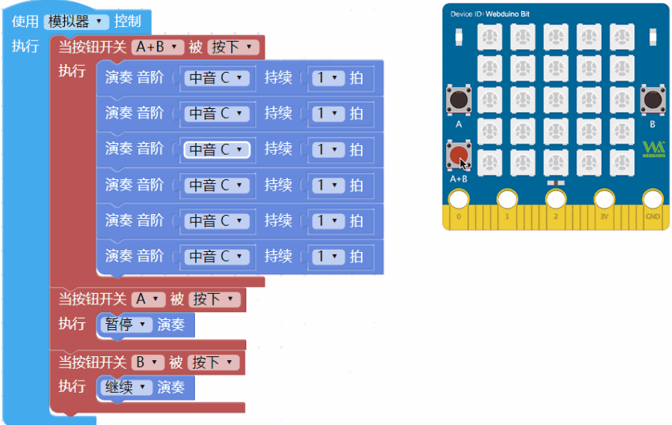

## 音乐＆声音

开发板内有一个微型蜂鸣器，可以发出三个八度音阶的单一声响，通过不同音符代码的组合，或者搭配内置的范例音乐，就能让开发板发出各种美妙的旋律。

### 音乐＆声音积木清单

音乐＆声音的积木包含演奏某个音阶、休息、预设音乐和停止演奏...等积木。

> *音乐＆声音积木必须搭配「开发板」积木*，选择模拟器，执行后可以听见电脑喇叭发出声音，选择USB，执行后会通过USB 连接方式控制实体开发板，让开发板的蜂鸣器发出声音。

### 演奏音阶

「演奏音阶」积木可以演奏三个八度音阶，同时亦可指定每个音阶的拍子，拍子分为 1/16、1/8、1/4、1/2、1 和 2 拍。

点选音阶的选项会弹出一个虚拟的钢琴键盘，使用鼠标移到琴键上，电脑的喇叭就会发出对应的声响。

在音阶的缺口，可以分别放入「音阶」和「休止符」积木，后面的缺口只能放入「拍子」积木。

放入好几个音阶，执行后可以听到一个音阶接着一个音阶播放。

由于「演奏音阶」积木会是「*演奏完成才会继续执行后方程序*」的类型，若程序放在音阶之后，在所有音阶演奏完成后，才会执行后面程序。

「演奏音阶」积木也可以搭配「无限循环」积木，做到不断重复播放一段旋律的效果。

「音阶」积木指出数组的使用，根据数组的排列组合，就能自行编辑音乐并重复使用，下图的例子，分别将音阶和拍子独立成两个数组。

> 使用「数组」的情况下，若音阶数量少于拍子，多出来的拍子会采用最后一个音阶播放，若拍子数量少于音阶，多出来的音阶会采用最后一个拍子播放。

### 演奏休息

「演奏休息」积木表示该拍子没有声音，等同于使用「演奏音阶」积木搭配「休止符」积木。

### 演奏音乐

「演奏音乐」积木包含超级玛丽、超级玛丽和弦、真善美、哥哥爸爸真伟大和小叮当五首音乐，可以独立使用或搭配「音阶」积木使用。

由于「演奏音乐」积木会是「*演奏完成才会继续执行后面程序*」的类型，若有音阶或其他程序放在演奏音乐之后，音乐演奏完成后，才会执行后面的程序。

### 停止/暂停/继续演奏

「停止/暂停/继续演奏」积木可以控制音乐演奏的行为。

下图的例子通过开发板的按钮开关控制音乐播放，A 和 B 同时按下时开始播放，播放进行中按下 A 就会暂停，按下 B 就会继续播放。

如果要将「音乐」、「音阶拍子」积木混合控制，在切换音乐之前加入「停止播放」积木，就可完全停止现有的音乐并进行切换。

### 测试报告

<table>
<thead>
<tr class="header">
<th>测试日期</th>
<th>测试环境</th>
<th>硬件版本</th>
<th>固件版本</th>
<th>软件版本</th>
<th>测试人员</th>
<th>测试结果</th>
</tr>
</thead>
<tbody>
<tr class="odd">
<td>2019年8月23日</td>
<td>Windwos7 &amp;Windwos10 &amp; browser</td>
<td>1.4</td>
<td>7NJfWecLminDsnEtpD</td>
<td>1.2.5</td>
<td>陈渊&amp;徐光发</td>
<td>有小问题：【停止演奏】积木需要内置部分延时</td>
</tr>
</tbody>
</table>