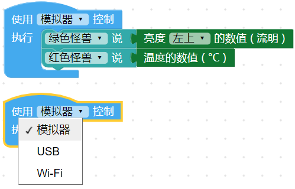
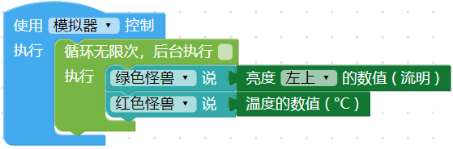
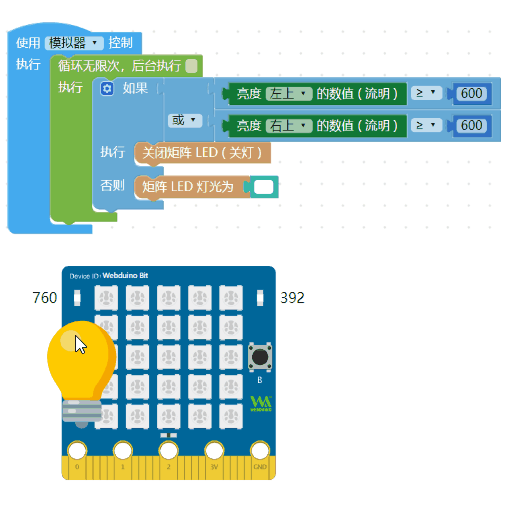
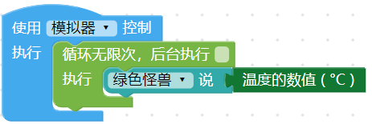
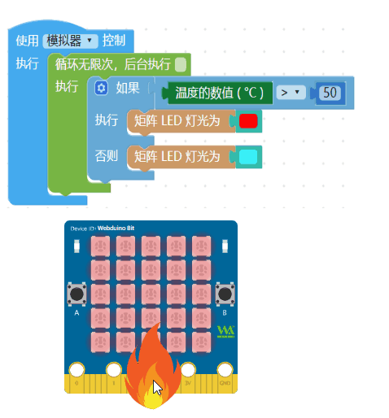

- | 测试日期      | 测试环境          | 硬件版本  | 固件版本           | 软件版本 | 测试人员      |测试结果 |
  | ------------- | ----------------- | --------- | ------------------ | -------- | ------------- |------------- |
  | 2019年8月23日 |  Windwos7 &Windwos10 & browser |  1.4 | 7NJfWecLminDsnEtpD | 1.2.5   | 陈渊&徐光发 |通过 |
## 光线＆温度

开发板内有两个光敏传感器，以及一个热敏电阻，光敏传感器可以检测环境光线的流明数值，热敏电阻则可检测到小数点两位的温度变化，通过对光线和温度的检测，就能做出环境监控相关的应用。

### 积木清单

检测光线分别可以检测左上和右上的亮度变化，检测的单位为流明，数值区间为 0~1000 的整数，温度检测的单位为 ℃（摄氏度），数值可到小数点两位。

> *检测光线和温度积木必须搭配「开发板」积木*，选择模拟器，执行后可以使用鼠标拖拉模拟器的灯泡或火焰。

### 检测光线

「检测光线」积木使用时只会检测一次，搭配「无限循环」积木就能进行连续检测。

执行后，如果是使用模拟器，*画面里会出现一个「灯泡」图案*，拉动「灯泡」靠近画面里的光敏电阻，就能模拟光线的变化，如果是使用实体开发板，可用光线照射光敏电阻观察光线变化。

了解光线检测原理后，若搭配简单的「逻辑」判断，就能做出小夜灯的效果，以下图的例子而言，只要左边或右边的任何一个光敏传感器检测到亮度大于等于600 流明，就会熄灯，反之左右两边只要同时检测的数值小于600 流明就会亮白灯。

### 检测温度

「检测温度」积木使用时只会检测一次，搭配「无限循环」积木就能进行连续检测。

执行后，如果是使用模拟器，*画面里会出现一个「火焰」图案*，拉动「火焰」靠近画面里的热敏电阻，就能模拟温度的变化，如果是使用实体开发板，可用手指按压热敏电阻、或用嘴对着热敏电阻吹气，就能观察温度变化。

了解温度检测原理后，若搭配简单的逻辑判断，就能做出用颜色反映温度的效果，当温度大于等于 50 度就呈现红色，反之小于 40 度就是蓝色。

