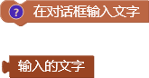
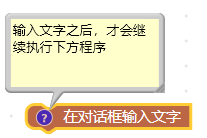
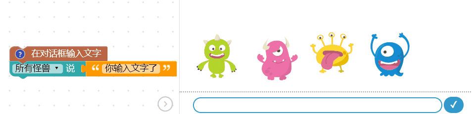
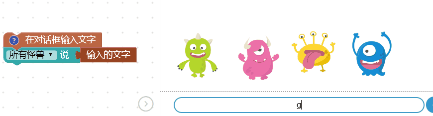
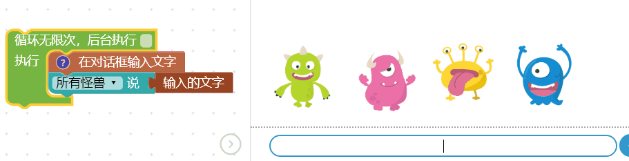

 <ul>
<li><table>
<thead>
<tr class="header">
<th>测试日期</th>
<th>测试环境</th>
<th>硬件版本</th>
<th>固件版本</th>
<th>软件版本</th>
<th>测试人员</th>
<th>测试结果</th>
</tr>
</thead>
<tbody>
<tr class="odd">
<td>2019年8月22日</td>
<td>Windwos7 &amp;Windwos10 &amp; browser</td>
<td>1.4</td>
<td>7NJfWecLminDsnEtpD</td>
<td>1.2.5</td>
<td>陈渊&amp;徐光发</td>
<td>存在小问题</td>
</tr>
</tbody>
</table>
<ul>
<li>输入对话框的勾号存在bug</li>
</ul></li>
</ul>

## 对话框输入文字

在编辑器中如果使用了「对话框输入文字」的积木，执行后，在怪兽互动舞台的画面底部，就会出现输入文字的对话框，通过输入文字就能进一步与开发板或小怪兽互动。

### 积木清单

对话框输入文字的积木有两种，第一种是「在对话框输入文字」，执行后会出现用来输入文字的对话框，第二种是「输入的文字」，执行后会取得所输入的文字。

### 对话框输入文字

「对话框输入文字」积木属于「*执行完成才会继续执行后方程序*」的类型( 点击前方问号会提示)，当编辑画面中有这块积木，*执行时当程序遇到这块积木会暂停，直到输入文字后才会再继续*。

举例来说，下方的程序里的小怪兽在执行后不会讲话，直到输入文字后才会说话。

### 获取输入的文字

「输入的文字」积木*一般都放在「对话框输入文字」积木之后*，用来获取输入的文字，将上述的例子稍做修改，如下图，就能够再让小怪兽讲出输入的文字。

### 重复输入文字

搭配「无限循环」积木，就能将上述的例子修改成「不断输入文字」的版本。

### 一问一答

通过输入文字的方式，能够轻松实现「一问一答」的效果，在输入文字积木之前摆放小怪兽询问姓名的文字，执行后会停留在输入文字的阶段，输入文字之后，通过「建立字串」积木，让小怪兽说出「XXX 你好」的文字组合。

