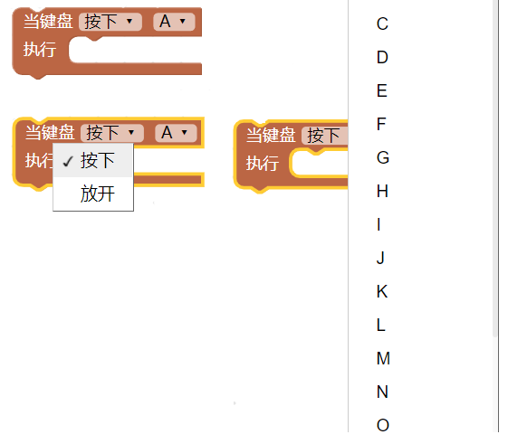
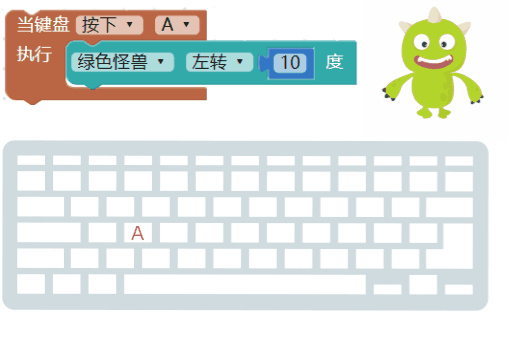

- | 测试日期      | 测试环境          | 硬件版本  | 固件版本           | 软件版本 | 测试人员      |测试结果 |
  | ------------- | ----------------- | --------- | ------------------ | -------- | ------------- |------------- |
  | 2019年8月22日 |  Windwos7 &Windwos10 & browser |  1.4 | 7NJfWecLminDsnEtpD | 1.2.5   | 陈渊&徐光发 |通过 |

## 键盘行为

鼠标和键盘是电脑必备的两大输入装置，熟悉了键盘的输入方式，就可以使用键盘进行简单交互，无论是要做成钢琴键盘还是游戏控制器都轻而易举，同时也可以搭配文字的输入，做出许多意想不到的互动效果。

### 检测键盘行为

「检测键盘行为」积木可以检测电脑键盘上大多数按键的按下与放开。

> 检测键盘行为积木*处于随时检测*的状态，*不需要搭配无限循环*。

用过按下和放开两种行为，就可以在按下键盘的同时，让小怪兽说出对应按键名称，放开键盘后就不说话。

按下键盘的行为会「*连续执行指令*」，类似在打字的时候，如果按着某个按键不放，画面中就会出现一连串这个按键的文字，例如下图，设定按下键盘A 的时候小怪兽会往左旋转，执行后，持续按住A 怪兽就会持续旋转，放开A 怪兽就会停止，不需要设定放开的指令。

### 键盘控制小怪兽移动

积木可以*同时检测多个键盘控制行为*，通过键盘行为就能很简单的做出「按下上下左右键，小怪兽就会上下左右移动」。

