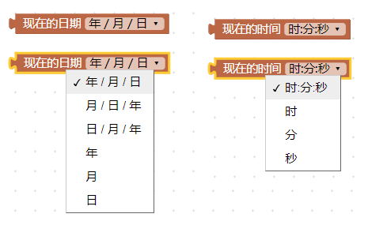
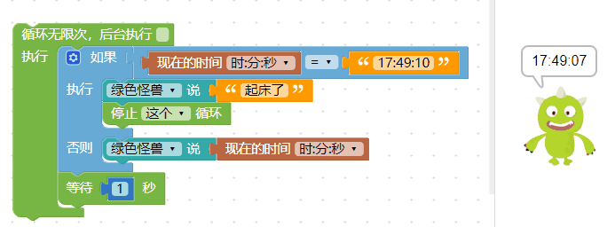

- | 测试日期      | 测试环境          | 硬件版本  | 固件版本           | 软件版本 | 测试人员      |测试结果 |
  | ------------- | ----------------- | --------- | ------------------ | -------- | ------------- |------------- |
  | 2019年8月22日 |  Windwos7 &Windwos10 & browser |  1.4 | 7NJfWecLminDsnEtpD | 1.2.5   | 陈渊&徐光发 |通过 |

## 日期＆时间

日期与时间的积木，可以读取电脑的日期和时间并在网页上显示，可以搭配循环、开关或键盘...等行为，做出时钟、码表、游戏计时...等应用。

### 取得目前日期与时间

「日期」积木能够取得目前的年、月、日，「时间」积木能够取得目前的小时、分钟、秒，小时采用 24 小时计算，如果是下午三点会显示 15。

### 时钟

所下图执行该积木即可取得时间，「*时间只会取得一次，所以需要搭配「无限循环」积木，如下图*」。

### 闹钟

延伸时钟的范例，搭配逻辑的积木，执行后就能做到在某个时间点产生提醒的闹钟功能。

> 判断时间到了之后，可以通过「停止循环」积木将时间停止，避免时间继续显示。

