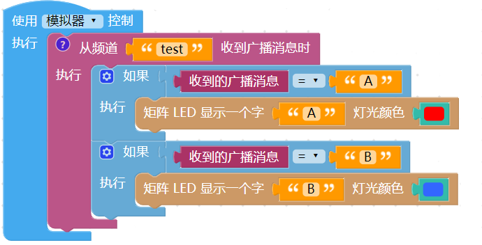
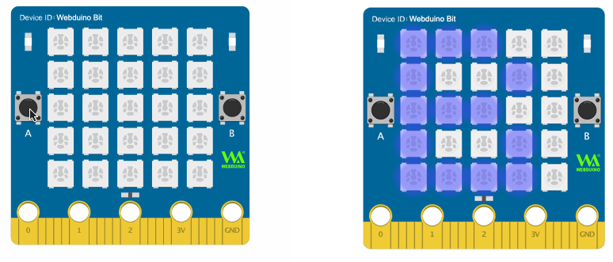

- | 测试日期      | 测试环境          | 硬件版本  | 固件版本           | 软件版本 | 测试人员      |测试结果 |
  | ------------- | ----------------- | --------- | ------------------ | -------- | ------------- |------------- |
  | 2019年8月26日 |  Windwos7 &Windwos10 & browser |  1.4 | 7NJfWecLminDsnEtpD | 1.2.5   | 陈渊&徐光发 |未通过 |
# 网络广播

网络广播功能，不仅能让与开发板彼此交换信息，更可以实现一对多、多对一、虚实互动、远距广播...等多样化的操控，通过广播功能的实现，便能将物联网的应用发挥到极致。

## 广播积木清单

广播积木包含一块负责发送广播消息的积木、一块负责接收广播消息的积木和一块呈现广播消息的积木。

## 发送广播消息

「发送广播消息」积木可以指定一个频道名称，以及要向这个频道发送的文字，只要频道名称相同，所有在该频道上的装置或人员，都能收到广播消息，*发送广播消息不限制只有实体装置能发送，不论是实体装置、虚拟装置、没有开发板的程序...等，都能够向指定频道发送消息*。

> 「发送广播消息」积木属于「*发送完成才会继续执行后面程序*」的类型( 点击前方问号会提示)，当编辑画面中有这块积木，*执行时当程序遇到这块积木会暂停，直到发送完广播消息后才会再继续*。

## 接收广播消息

「接收广播消息」积木可以指定一个频道名称，就能不断收听这个频道的变化，只要有人或开发板向这个频道发送消息，就能够通过广播消息的积木显示，*接收广播消息不限制只有实体装置能接收，不论是实体装置、虚拟装置、没有开发板的程序...等，都能够接收指定频道的消息*。

> 「接收广播消息」积木属于「*不间断收听频道*」的类型 ( 点击前方问号会提示 )，不需要放在循环内，就会不断地收听频道消息。

举例来说，使用者A 可以在「点击小怪兽」的同时，向频道test 发送广播消息，而使用者B 和C 负责收听test 频道，如果有收到，就让的小怪兽显示收到的广播消息。

又或者可以使用 开发板的按钮开关，按下 A 的时候向 test 频道发送文字 A，按下 B 的时候发送文字 B。

收听 test 频道的的开发板可以撰写逻辑判断，当收到 A 的时候显示红色的 A，收到 B 的时候显示蓝色的 B。

两块开发板的程序都执行后，点击负责发送广播的开发板的按钮开关，就可以看到另外一块开发板显示对应的消息。

