- | 测试日期      | 测试环境          | 硬件版本  | 固件版本           | 软件版本 | 测试人员      |测试结果 |
  | ------------- | ----------------- | --------- | ------------------ | -------- | ------------- |------------- |
  | 2019年8月22日 |  Windwos7 &Windwos10 & browser |  1.4 | 7NJfWecLminDsnEtpD | 1.2.5   | 陈渊&徐光发 |通过 |

## 小怪兽基本操作

编辑器设计了四只可爱的小怪兽，通过程序积木编排逻辑顺序，就能控制每只小怪兽的说话、声音、互动和行为等动作，甚至能进一步与实体开发板互动，做出更多好玩的有趣应用。

### 小怪兽积木清单 ( 基本操作 )

基本操作小怪兽的积木分别有讲话、展示图片、情绪、改变位置、改变角度、改变大小、显示隐藏和阶层...等，可以通过这些积木控制小怪兽的外在表现。

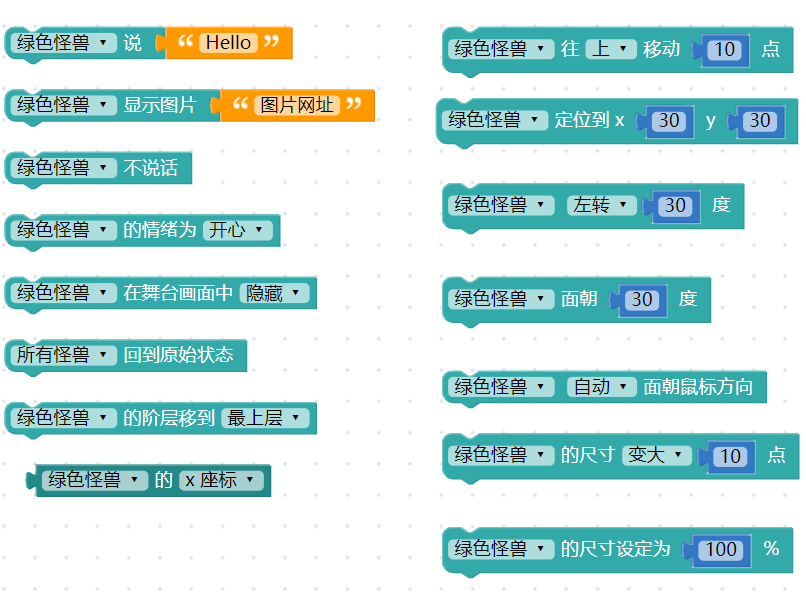

### 讲话＆不讲话

「讲话」和「不讲话」积木可以让小怪兽讲出指定的文字，或不要讲出文字，通过下拉选单也可以选择哪一只小怪兽讲话，或所有小怪兽一起讲话。

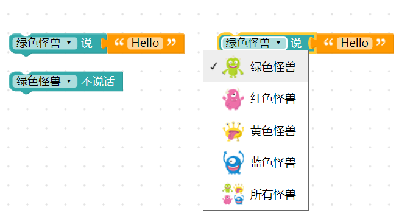

只要在讲话的积木后方，连接指定的文字，执行后小怪兽就会说出指定的文字。

只要把文字留空，或者使用不说话的积木，就能够让小怪兽不说话。

### 展示图片

「展示图片」积木可以让小怪兽展示一张「网络图片」。

举例来说，从百度百科上搜寻[蒙娜丽莎]，可以得到这张图片的「[网址](https://upload.wikimedia.org/wikipedia/commons/thumb/e/ec/Mona_Lisa%2C_by_Leonardo_da_Vinci%2C_from_C2RMF_retouched.jpg/460px-Mona_Lisa%2C_by_Leonardo_da_Vinci%2C_from_C2RMF_retouched.jpg#_blank)」，复制图片网址，贴到小怪兽展示图片的文字空格内，执行后，就会看见小怪兽展示这张图片。

> 目前图片格式仅支持 jpg、jpeg、png、gif（图片网址结尾必须带有图片格式才能显示图片）

### 情绪

「情绪」积木可以改变小怪兽的情绪，包含开心、惊讶、生气、难过和随机情绪。

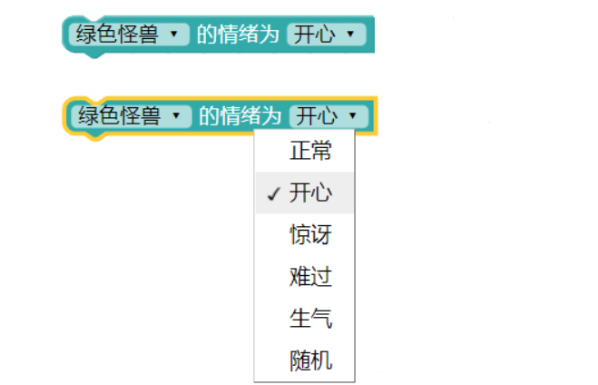

选择对应的小怪兽 ( 也可以四只同时 )，选择对应的情绪，执行后就会看见小怪兽的情绪变化。

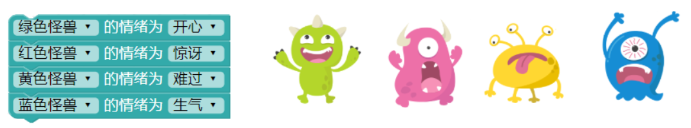

### 改变位置

「改变位置」积木可以指定小怪兽改变*目前的位置*，选项有往上、往下、往左、往右、随机或朝向鼠标方向。

如下图，搭配「循环十次」和「等待 0.1 秒」积木，就能够让小怪兽往右上方移动。

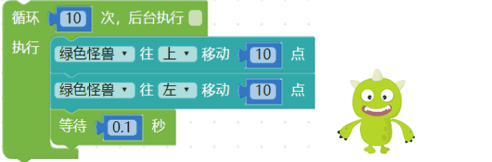

如果使用「无限循环」积木，搭配「朝着鼠标位置」的设定，就能够让小怪兽追着鼠标移动。

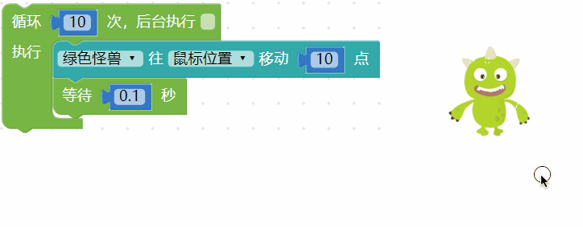

### 定位

「定位」积木能够把小怪兽摆放到指定的坐标位置。

怪兽的座标系统采用*笛卡尔直角座标系统* (直角座标系统)，往上y 为正，往右x 为正，而(0,0) *原点位在怪兽互动舞台的左下角*，指定小怪兽xy 坐标，执行后小怪兽就会出现在指定的位置。

### 旋转角度

「旋转角度」可以指定小怪兽改变*目前的角度*，选项有往左或往右。

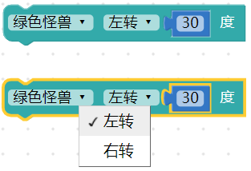

搭配「无限循环」积木，就能让小怪兽不断的每隔 0.1 秒旋转 10 度。

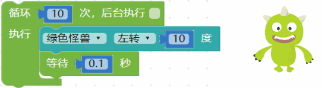

### 面朝方向

「面朝方向」角度可以指定小怪兽旋转的角度，顺时针为正，逆时针为负。

因为「面朝方向」是指定一个角度，如果要做到和前一个积木「旋转角度」一样的效果，可以使用变量搭配「无限循环」积木，在每一次执行时修改变量数值即可。

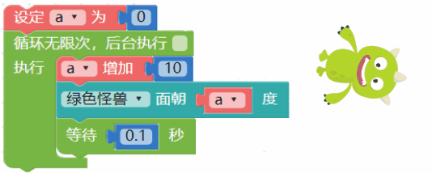

### 自动面朝鼠标方向

「自动面朝鼠标方向」积木能让小怪兽转到鼠标所在的方向，有自动和停止两个选项。

因为「自动面朝鼠标方向」只会执行一次，所以如果要让小怪兽不断的面向鼠标，就必须搭配无限循环的积木，如下图，执行后小怪兽就会自动面向鼠标旋转。

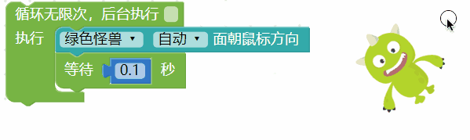

### 取得座标和角度

「取得座标和角度」积木能够读取小怪兽当前的 X 座标、Y 座标和旋转角度。

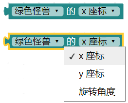

下图的例子，就能让小怪兽自己讲出自己的 X 座标、Y 座标和旋转角度。

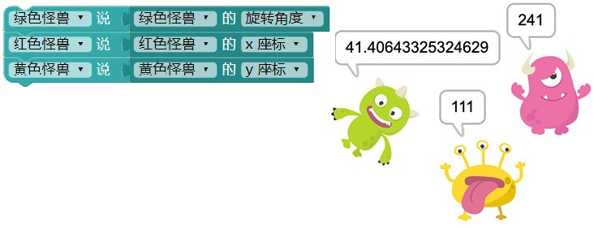

### 尺寸放大缩小

「尺寸放大缩小」积木可以指定小怪兽改变*目前的大小*，选项有放大或缩小。

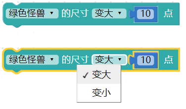

搭配「循环十次」和「等待 0.1 秒」积木，执行后，就能够让小怪兽逐渐变大。

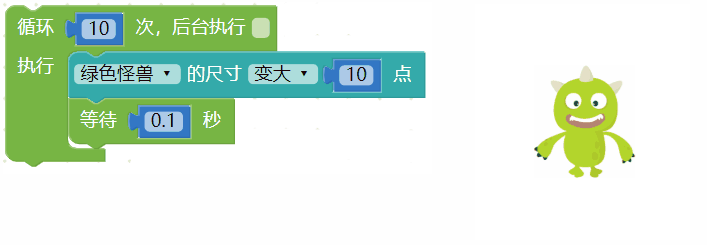

### 尺寸百分比

「尺寸百分比」积木可以指定小怪兽放大缩小的百分比。

由于 100% 表示原本怪兽大小，所以 200% 就会是一倍大，50% 则是会缩成 1/2 大小，下图通过尺寸百分比，分别让四只小怪兽呈现不同尺寸大小。

### 显示/不显示

「显示/不显示」积木可以指定小怪兽是否显示在互动舞台区。

### 阶层

「阶层」积木可以指定小怪兽排列的阶层，最上层在最前面，最下层在最后面。

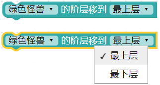

通过「循环」以及「等待」积木，能够让小怪兽的阶层依序显示在最前面。

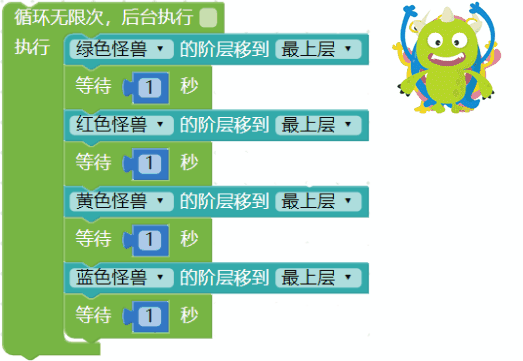

### 回到原始状态

「回到原始状态」积木可以让小怪兽回到初始状态，初始状态包含不说话、预设座标、预设旋转角度和预设尺寸大小。

