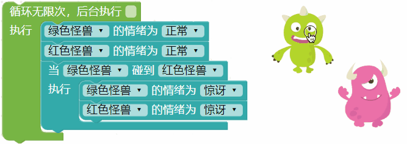
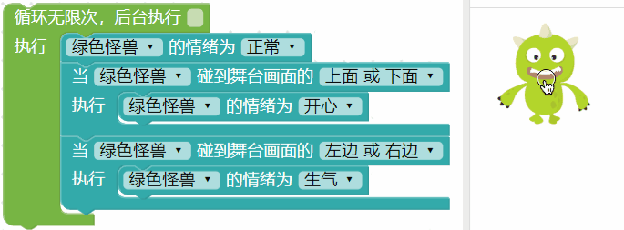
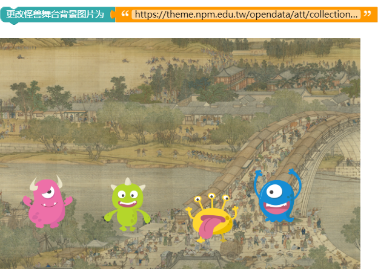
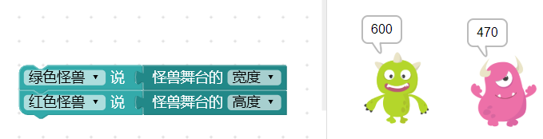

 <ul>
<li><table>
<thead>
<tr class="header">
<th>测试日期</th>
<th>测试环境</th>
<th>硬件版本</th>
<th>固件版本</th>
<th>软件版本</th>
<th>测试人员</th>
<th>测试结果</th>
</tr>
</thead>
<tbody>
<tr class="odd">
<td>2019年8月22日</td>
<td>Windwos7 &amp;Windwos10 &amp; browser</td>
<td>1.4</td>
<td>7NJfWecLminDsnEtpD</td>
<td>1.2.5</td>
<td>陈渊&amp;徐光发</td>
<td>通过</td>
</tr>
</tbody>
</table></li>
</ul>

## 小怪兽互动＆舞台

除了可以设定小怪兽的位置或大小，编辑器更能让我们与小怪兽互动，例如用鼠标点击小怪兽、小怪兽互相碰撞、碰撞舞台画面边缘...等。

### 小怪兽积木清单 ( 互动＆舞台 )

互动＆舞台的积木分别有鼠标点击小怪兽、鼠标触碰小怪兽、小怪兽互相碰撞、小怪兽碰撞舞台边缘、碰到舞台边缘就反弹、更换舞台背景和设定为全屏幕。

### 鼠标点击

「鼠标点击」积木可以在鼠标点击小怪兽时，让小怪兽做指定的事情。

> 鼠标点击积木「*不需要放在循环内*」就可重复检测，并在后台执行。

下图的例子，点击绿色小怪兽时会说话，点击红色小怪兽会放大，点击黄色小怪兽会旋转，点击蓝色小怪兽会改变情绪。

### 鼠标触碰

「鼠标触碰」积木包含两个行为动作，分别是鼠标触碰到小怪兽要做什么事，以及鼠标离开小怪兽后要做什么事。

> 注意，离开的行为动作一定会接在触碰之后，鼠标触碰积木「*不需要放在循环内*」就可重复检测。

下图的例子，在鼠标触碰到绿色小怪兽时，小怪兽的情绪会开心，鼠标离开后小怪兽又恢复正常的情绪。

### 互相触碰

「互相触碰」积木可以检测小怪兽彼此之间是否有触碰。

>「互相触碰」积木「*只会检测一次*」，必须*搭配循环*，才能重复检测。

以下图为例，搭配「无限循环」积木就能不断检测小怪兽是否互相触碰。用鼠标拉动小怪兽，当两只小怪兽相碰时，小怪兽就变成惊讶的情绪，分开后又恢复正常。

### 触碰舞台边缘

「触碰舞台边缘」积木可以检测小怪兽是否触碰到互动舞台的四个边，或指定检测碰到上、下、左、右四个边的行为。

>「触碰舞台边缘」积木「*只会检测一次*」，必须*搭配循环*，才能重复检测。

以下图为例，搭配「无限循环」积木就能让小怪兽碰到舞台画面上边缘或下边缘时，变成开心的情绪，碰到左边缘或右边缘则呈现生气的情绪，没有碰到时则是正常情绪。

### 触碰舞台边缘就反弹

「触碰舞台边缘就反弹」积木是「触碰舞台边缘」积木的简化版，将碰触后的行为单一化为「反弹」，反弹表示位置的相反，*如果碰到舞台左右两侧，则小怪兽移动的X 方向会相反，如果碰到舞台上下两侧，则小怪兽移动的Y 方向会相反*。

>「触碰舞台边缘就反弹」积木「*只会检测一次*」，必须*搭配循环*，才能重复检测。

以下图为例，搭配「无限循环」积木碰到舞台边缘时就会反弹。

### 更换舞台背景颜色或图片

「更换舞台背景颜色」和「更换舞台背景图片」，可以改变怪兽舞台背景为指定的颜色或图片，图片只要填入图片网址，执行后就会更换。 ( 图片支持 jpg、jpeg、png 和 gif )

举例来说，找一张[清明上河图](https://theme.npm.edu.tw/opendata/att/collectionPic/04015934/17024347.jpg#_blank)的图片网址，将网址贴上在背景图片的文字积木内，执行后就会看见舞台背景变成清明上河图了。

### 设定舞台为全屏幕

「设定舞台为全屏幕」积木不影响任何操作，只会在「执行时」把怪兽互动舞台变成全屏幕大小。

如果不想使用该功能，也可以手动操作，点选怪兽互动舞台右上方的小按钮，也可以进行全屏幕的切换。

### 取得舞台尺寸

「取得舞台尺寸」积木可以取得当下怪兽互动舞台的宽度或高度。

下图的例子会在执行的时候，绿色小怪兽讲出舞台宽度，红色小怪兽讲出舞台高度。

